# Thermal Lift 工作总结图册

> 红外热像微扫描 2x 轮廓级超分辨率 POC · 全部出版级结果图（2026-06 → 2026-07，ACL-023 → ACL-080）

本册收录 `figures/` 目录下全部 72 张已生成的出版级图，按**项目叙事主线**重排为序章 + 七章 + 附录：从原始数据审计与物理标定出发，经评价方法论修复、求解器架构演化、合成训练数据引擎、点保真攻坚，到泛化判决与最终视觉成果。每张图的原始说明与可复现指针（脚本 + 数据源 + ACL 引用）逐字保留，未删除任何图。图片路径均相对本文件所在目录（`docs/publication_figures/`）；维护规则（改图只改对应脚本、配色语义固定等）见同目录 `README.md`，本文件只做展示与导览。

---

## 项目一页纸

**任务**：面向工业芯片检测，在 20 µm 采样 pitch / 20 µm 空间分辨率的 LWIR 温度矩阵上，用主会话 248 帧微扫描序列验证 **2x 轮廓级超分辨率**（输出 10 µm/sample 网格）——让芯片内部结构/形状的轮廓更清楚、更稳定，而非追求计量级温度读数。

**技术路线**：物理前向算子（PSF 模糊 + 2x 块降采样）+ 物理约束展开求解器（unrolled solver：神经 prox 先验与数据一致性 DC 步交替）+ TCForge 程序化合成训练池；以经典方法 drizzle / TGV / MAP-TV 为独立参照与"要打败的对象"。

### 关键物理参数

| 参数 | 值 | 备注 |
|---|---|---|
| 探测器 | 640×480 px，LWIR 8–14 µm | |
| 采样 pitch / 空间分辨率 | 20 µm/px / 20 µm | 数值巧合相等、概念不同，见 fig19 |
| 台架→像素旋转角 θ | 47.6° | AVI 连续扫描独立验证 47.14°，CI 覆盖，见 fig53 |
| 光学 PSF | Gaussian σ ≈ 0.1–0.4 LR px（鲁棒带） | 点校准不可行，见 fig48 |
| 探测器噪声底 | 0.0724 °C | |
| SR 输入 | 主会话 248 帧 clean 微扫描序列 | 自 263 帧审计筛出，见 fig54 |
| SR 输出 | 2x，10 µm/sample HR 网格 | |

### 头条成果

| # | 成果 | 数值 / 结论 | 图 |
|---|---|---|---|
| 1 | 权威可恢复频带 | 34.07 µm → **25.45 ± 0.73 µm**（修复 ~0.3 px 逐帧对齐误差后，ACL-048） | fig21 |
| 2 | 评测方法论翻案 | 神经输出网格 +0.5 px 角点约定曾系统性压低所有神经×经典对比；校正后 v11×TGV cross-FRC@30µm 0.04→0.83（ACL-049） | fig07 / fig92 |
| 3 | 经典基线（要打败的对象） | TGV：cutoff 23.03 µm / cross-FRC@30µm 0.7017 | fig06 |
| 4 | 神经冠军 depb9v6 | cross-FRC@30µm 0.6611；OOD 13/13 池完胜 TGV(oracle)（Δ+0.171）；低频干净 | fig02 / fig03 / fig99 |
| 5 | 点保真攻坚 | 孤立点抹除率 43%（v7 病理）→ 4.35%（v8）→ 1.55%（v9）→ **0.00%**（v9-3k） | fig01 / fig62 |
| 6 | 点保真↔OOD 权衡定律 | 点保真冠军 v9-3k 域外 0/13 全输——两轴呈单调权衡（ACL-079） | fig99 |
| 7 | 零训练自审计仪表 | 被抹除的点在留出 DC 残差中可检出（AUC 0.68–0.84，ACL-075） | fig04 / fig61 |
| 8 | "最锐 ≠ 最优" | 目视最锐的 v5 臂 cross-FRC 仅 0.626（神经最低档）——锐度大半是幻觉（ACL-080） | fig98 |
| 9 | 2x 是当前数据的合理倍率 | 实测相位占用 11/25 bin：2x 支撑充分，>2x 相位饥饿（EP15-M1） | fig34 |

### 项目阶段时间线

| 阶段 | 时间 | 主题 | ACL | 代表图 |
|---|---|---|---|---|
| I | 2026-06 上中旬 | UNet SR 基线与论文 harness（V4→V10 loss 实验、TCForge AA 池、TGV 基线修复、EP12/EP15 基准） | 001–022 | fig51、fig52 |
| II | 06-25 → 07-01 | 像元重标定（20 µm）+ 展开 solver 立项与架构攻坚（K4 伪影根因、noSE/noGN、halo 推理） | 023–043 | fig16、fig22–24、fig12 |
| III | 07-02 → 07-06 | 评测仪器修复 "stage0 saga"（self-FRC 判无效、精修对齐、+0.5 px 翻案、权威频带落定） | 044–050 | fig21、fig32、fig07 |
| IV | 07-07 → 07-08 | η 校准、σ 自校准线、Stage 2b 合成基准、v7 生成器落地 | 051–065 | fig14、fig48、fig20 |
| V | 07-08 → 07-10 | 点保真传奇与训练池演化（v7 病理 → 归因 → v8/v9 修复） | 063–074 | fig01、fig35、fig62 |
| VI | 07-11 → 07-13 | 收官判决（DC 自审计、13 池 OOD、多切分验证、权衡定律、v5 复评） | 075–080 | fig99、fig94、fig98 |

### 阅读指南

- 图号（fig00–fig99）是历史生成顺序，**不是阅读顺序**；本册按叙事重排，图号速查见附录 B。
- 每图末尾的斜体行（*Script / Data*）是可复现指针：改图只改对应脚本，数值可溯源到 `research_log/algorithm_changelog.md` 中的 ACL 编号。
- 配色语义全册固定：TGV **黑**、MAP-TV **棕**、drizzle **橙**、神经臂按训练池 v6 **蓝** / v8 **紫** / v9 **红** / v9-3k **绿**。
- 两条硬口径：① 20 µm 空间周期是探测器孔径零点，任何 20 µm 处的 FRC 数值不采信（图中以斜纹区标注）；② 对神经方法只采信"对独立参照（drizzle）的 cross-FRC + 逐半偏移校正"，自分半 FRC 无效（原因见第二章）。

### 术语速查

| 术语 | 含义 |
|---|---|
| LR / HR | 低分辨率原始帧（20 µm/px）/ 高分辨率重建网格（10 µm/px，2x） |
| drizzle | 经典多帧网格化叠加方法；诚实但偏软，用作 cross-FRC 的独立参照锚 |
| TGV / MAP-TV | 两种经典正则化重建基线（"要打败的对象"） |
| FRC / cross-FRC | Fourier Ring Correlation，频域一致性度量；cross = 与独立方法（drizzle）互证，数值越高该频率上的结构越可信 |
| FRC@30µm | 30 µm 空间周期处的 FRC 值，本项目主决策指标 |
| cutoff | half-bit 准则给出的可分辨截止周期，越小越好 |
| unrolled solver | 物理约束展开求解器 = 本项目自研主线架构（神经 prox 先验 + DC 数据一致性交替迭代） |
| DC（数据一致性） | 强制重建经前向算子回投后与实测帧一致的步骤；其权重记作 η |
| 训练池 v6/v7/v8/v9/v9-3k | TCForge 合成场景训练数据集的代际（数字 = 配方代，3k = 3000 景规模） |
| 点保真 / 抹除率（retention / erased%） | 小暗缺陷点在重建中被保留 / 被抹掉的比例——工业检测最不可妥协的轴 |
| OOD | 分布外（训练分布之外的内容 / 噪声）稳健性 |
| range_excursion | 重建低频稳定性指标，异常偏大 = 低频发散 |
| halo | 推理时给求解窗口外圈补的上下文边距（HR px） |
| σ (PSF sigma) | 光学点扩散函数宽度 |
| phase bin | 亚像素相位分箱（多帧按亚像素偏移归组的通道数，9-bin / 4-bin 等） |
| ACL-xxx | `research_log/algorithm_changelog.md` 中的算法变更编号（全项目 80 条） |

---

## 目录

- [序章 项目全景](#序章-项目全景)（2 图）
- [第一章 数据与物理基础](#第一章-数据与物理基础)（6 图）
- [第二章 诚实的测量仪器：评价方法论](#第二章-诚实的测量仪器评价方法论)（11 图）
- [第三章 重建算法演化：从 UNet 到物理展开 solver](#第三章-重建算法演化从-unet-到物理展开-solver)（13 图）
- [第四章 合成训练数据引擎 TCForge](#第四章-合成训练数据引擎-tcforge)（4 图）
- [第五章 点保真攻坚与训练池演化](#第五章-点保真攻坚与训练池演化)（15 图）
- [第六章 泛化能力与冠军判决](#第六章-泛化能力与冠军判决)（13 图）
- [第七章 最终视觉成果](#第七章-最终视觉成果)（6 图）
- [附录 A 早期方法基准补遗](#附录-a-早期方法基准补遗)（2 图）
- [附录 B 图号速查表](#附录-b-图号速查表)

---

## 序章 项目全景

两张图给出全项目的“一页纸”视角：fig00 把研究主线压缩为“四幕 + 一个判决”——物理地基、诚实仪器、算法与先验、权衡定律，收敛到均衡冠军 depb9v6；fig90 是全部 80 条算法变更（ACL）的编年史，六个阶段各做了什么一图可查。后续各章即按此脉络展开。

### Fig 00 — The Storyline in Four Acts

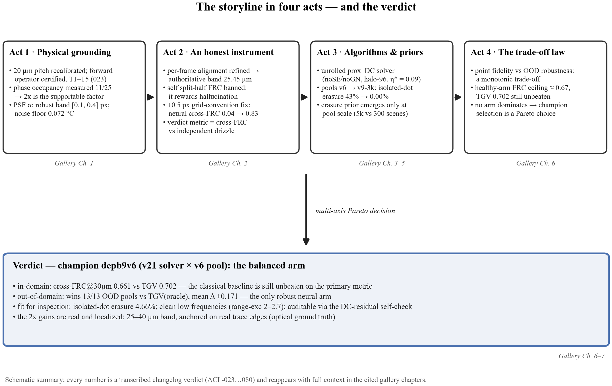

**全册开篇：把几个月的工作串成“四幕 + 一个判决”。** 物理地基 → 诚实仪器 → 算法与先验 → 权衡定律，最终收敛到均衡冠军 depb9v6。图中每个数字都是变更日志里的正式判决，并在所引章节中以完整证据再次出现。

*Script: `scripts/fig00_main_narrative.py` · Data: 纯示意（数值转录自 ACL-023~080 判决，均在所引章节的图中复现）*

### Fig 90 — Project Chronicle: Six Phases on the ACL Progress Axis

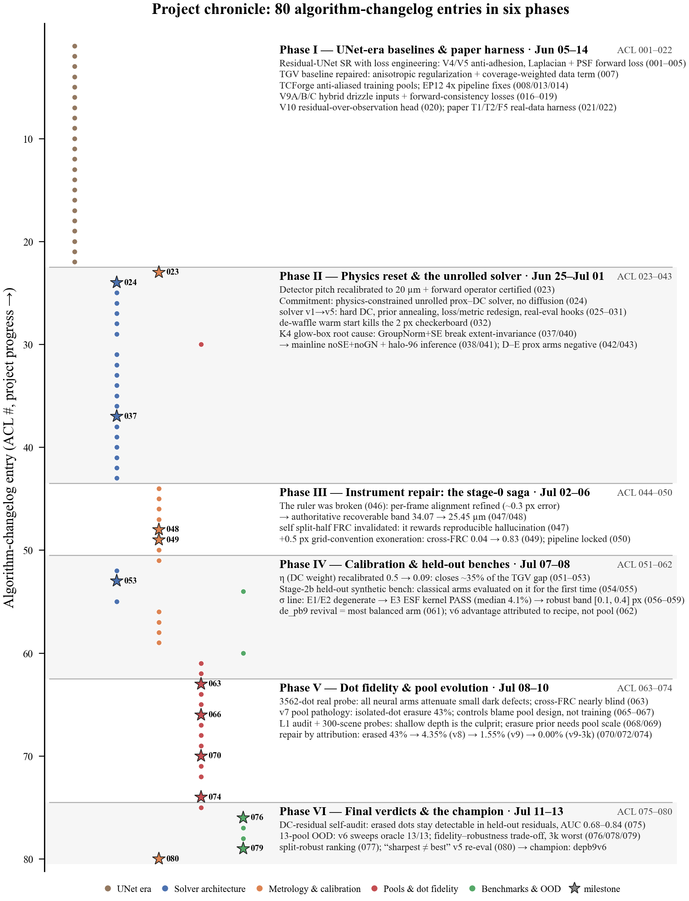

**全项目 80 条算法变更的编年史：六个阶段各做了什么、节奏与密度如何，一图可查。** 纵轴为 ACL 序号（进度轴，无日历空档），左侧五列彩点按主题归类（关键词规则，代码内可审计），右侧黑字直接摘录各阶段的实验内容与关键判决，星标为里程碑。ACL-073 无日志标题故缺席。

*Script: `scripts/fig90_project_timeline.py` · Data: `research_log/algorithm_changelog.md`（现场解析标题行）*

---

## 第一章 数据与物理基础

所有后续结论都建立在三件事之上：**数据本身干净、坐标模型正确、前向物理算子可信**。本章回答五个地基问题：数据从哪来、263 帧中哪些可用（fig54）；"20 µm"到底指什么——采样 pitch、空间分辨率、SR 输出网格三个概念必须分开（fig19）；电动台命令位移如何映射到像素、旋转角 θ 是否可信（fig53）；PSF 模糊 + 降采样的前向算子是否通过自检认证（fig16）；以及 PSF 宽度 σ 能否从数据自标定——答案是点校准不可行，最终收敛为鲁棒带 σ∈[0.1, 0.4] px（fig48，详图 fig13）。

| 图 | 内容 | 关键结论 |
|---|---|---|
| fig54 | 263 帧采集审计 | 248 帧 SR 可用（94.3%）；冷流产段 +3.6°C 跃变必须剔除 |
| fig19 | 采样 / 分辨率 / SR 网格概念区分 | 20 µm pitch ≠ 20 µm 分辨率 ≠ 10 µm SR 网格 |
| fig53 | EP02 位移标定 | 命令步长产生预期像素位移（2 µm 亚像素步真实可见）；θ=47.6° 被 AVI 独立验证覆盖 |
| fig16 | 前向算子自检 | T1–T5 全过；混叠能量占比仅 2.91% |
| fig48 | σ 校准三幕叙事 | 点校准 FAIL → 合成 bench PASS → 真实数据合法拒绝 → 鲁棒带策略 |
| fig13 | σ E3 估计器 bench 详图 | 27 场景相对误差中位 4.1%，远低于 15% 容差 |

### Fig 54 — EP01 Acquisition Sessions & Step-Stop Raster Trajectory

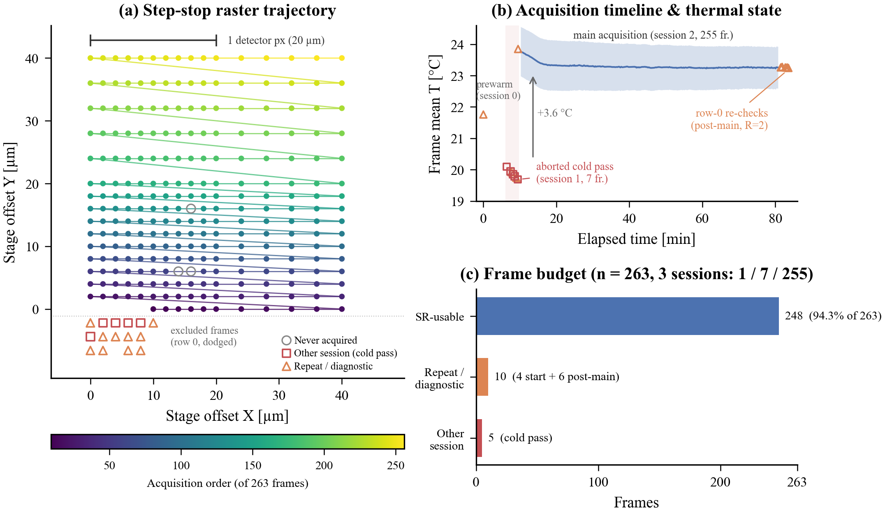

**一切的起点：263 帧原始数据的“人口普查”，定下 248 帧 clean 主会话这个全项目数据基座。** 三面板：亚像素步进-静止 raster 轨迹（整个扫描行程只有 2 个探测器像元）、mtime 会话时间线（冷流产段 +3.6°C 跃变→热稳定主会话）、帧预算（248 帧 SR 可用，94.3%）。

*Script: `scripts/fig54_ep01_acquisition.py` · Data: `output/ep01_data_processing/frame_audit.csv`（EP01 数据处理审计）*

### Fig 19 — Detector Pitch vs Resolution vs SR Grid

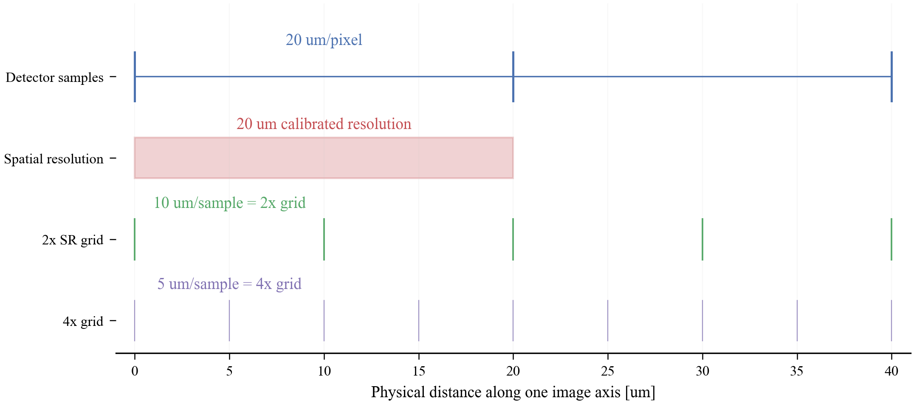

**全项目最容易混淆的三个概念，在同一物理距离轴上一次性厘清。** 20µm/px 是探测器采样间距、20µm 是标定空间分辨率、10µm/sample 是 2x SR 输出网格——三者不可互换，后续所有指标都建立在这个区分上。

*Script: `scripts/fig19_sampling_resolution.py` · Data: `thermal_core.ep03`（ACL-023）*

### Fig 53 — EP02 Displacement Calibration: θ Forest + Visible-vs-Commanded Displacement

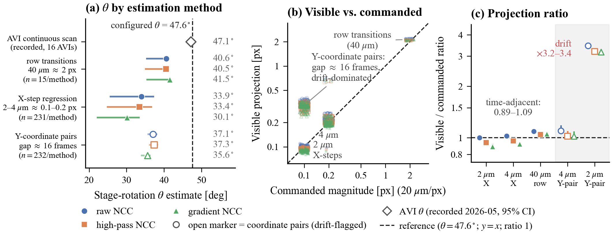

**位移模型的地基：电动台命令步长确实产生预期的像素位移，θ=47.6° 配置可信。** 三档时间相邻位移（0.1/0.2/2 px）全部落在 y=x 上，2µm 亚像素步进真实可见；θ 森林图显示 TXT NCC 证据只作方向 smoke test，覆盖配置值的是 AVI 连续扫描独立验证（47.14°，CI 覆盖 47.6°）；Y 坐标对因热漂移膨胀 ×3.2–3.4——时间相邻性是位移证据成立的先决条件。

*Script: `scripts/fig53_ep02_theta_displacement.py` · Data: `remote_inbox/20260715_ep02_recal/`（EP02 2026-07-15 5090 重建缓存；AVI θ 引自 `research_log/episodes/ep02_displacement_calibration/README.md` 2026-05-17 记录）*

### Fig 16 — Forward-Operator Self-Check

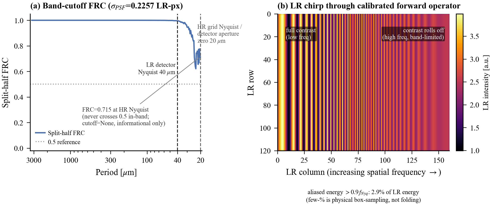

**前向物理算子（PSF 模糊 + 2x 块降采样）通过 T1–T5 自检认证——solver 的 DC 步从此有可信的物理内核。** 合成 phantom 分半 FRC 在解析带内不越过 half-bit 线；chirp 目标对比度随频率单调衰减、无折叠伪影（混叠能量占比仅 2.91%）。

*Script: `scripts/fig16_forward_selfcheck.py` · Data: `output/forward_selfcheck/{selfcheck_summary.json,band_cutoff_frc_*.npy,aliasing_lr_chirp.npy}`（ACL-023）*

### Fig 48 — The Sigma Calibration Line: A Three-Act Narrative

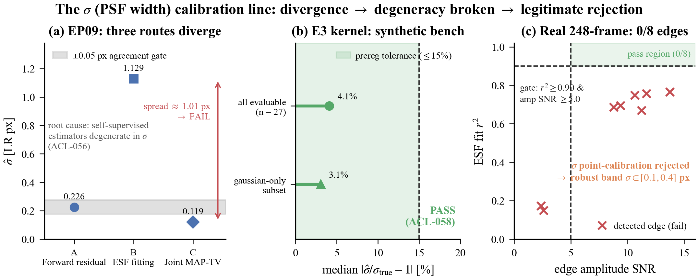

**PSF 宽度 σ 能否自标定？三幕诚实收场：点校准不可行，改用鲁棒带。** EP09 三路点校准发散 FAIL（后证实为估计器族在 σ 维度退化）→ E3 多帧 ESF 估计器合成 bench 复判 PASS（中位误差 4.1%）→ 真实数据 0/8 条边过质量门、合法拒绝——最终策略：σ∈[0.1, 0.4] px 鲁棒带。

*Script: `scripts/fig48_sigma_line_narrative.py` · Data: `research_log/episodes/ep09_psf_calibration/README.md`、`output/sigma_esf_bench_reverdict/bench_verdict.json`、`remote_inbox/20260712_sigma/sigma_esf_real/real248_esf_summary.json`（ACL-056~059）*

### Fig 13 — Sigma Self-Calibration (E3) Bench Re-Verdict

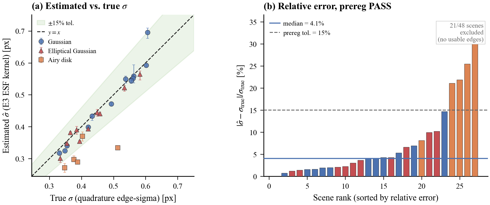

**fig48 第二幕的详图：E3 估计器打破 σ 退化，合成基准复判 PASS。** 修正基准真值后，27 个可评估场景的相对误差中位数约 4.1%，远低于预注册 15% 容差（21/48 场景无可用边被单独统计）。

*Script: `scripts/fig13_sigma_selfcal_bench.py` · Data: `output/sigma_esf_bench_reverdict/{bench_rows.csv,bench_verdict.json}`（ACL-056/057/058）*

---

## 第二章 诚实的测量仪器：评价方法论

项目中期最重要的转折不是某个新模型，而是发现**评测仪表本身失效**（ACL-046 判 inconclusive）。三个连环问题被逐一定位并修复：① 逐帧对齐误差 ~0.3 px 是头号信息瓶颈，修复后权威可恢复频带从 34.07 µm 改善到 25.45 µm（fig21）；② 自分半 FRC 对确定性神经网络无效——两个半幅会复现同样的"幻觉"高频细节，把假细节评成高分（fig32，视觉版 fig63；对照组 drizzle 的自分半则对切分方式稳健，fig31）；③ 神经输出网格自带 +0.5 px 角点约定（设计而非 bug），此前所有神经×经典对比被系统性压低 ~0.4 FRC 点，"神经带内破坏"的旧结论被翻案（fig07），校正入默认流程后各时代残余偏移 ≤0.1 px（fig29）。修复后的判据管线（fig92）产出本项目权威的真实域 FRC 排行榜（fig06，频带表 fig33），并回答了"为什么做 2x 而不是 4x"（fig34）；fig30 是同期 0d 回归指标套件的可分性审计。**本章的产出是后续一切判决的可信度基础。**

| 图 | 内容 | 关键结论 |
|---|---|---|
| fig92 | 判据管线流程图 | 强制偏移校正 + cross-FRC；自 FRC 与跳过校正两条捷径被明令禁用 |
| fig21 | 逐帧 shift 精修 | 0.31 px RMS 误差修复 → 权威频带 34.07 → 25.45 µm |
| fig32 | same-half 对照 | 神经自分半 0.92+ 是幻觉膨胀；诚实差距拆为 ~0.4（幻觉）+ ~0.4（配准）两段 |
| fig63 | 平坦区频带纹理相关（视觉版） | TGV r=0.84 / v6 r=0.70 两半复现同样纹理；drizzle r=0.15 诚实噪声 |
| fig31 | drizzle 分半稳健性 | 两种切分约定下曲线重合——独立参照自洽 |
| fig07 | +0.5 px 伪影翻案 | 神经对经典实测偏移 0.6–0.8 px；校正后 cross-FRC 0.04→0.83 |
| fig29 | 偏移探针跨时代稳定性 | 校正入默认后各代残余 ≤0.10 HR px，仪器持续在标 |
| fig06 | 真实域 cross-FRC 排行榜 | TGV 0.7017@30µm；25–40 µm 真实增益带 |
| fig33 | 跨方法频带表 | 方法在 30–24 µm 决策频带分化；20 µm 列不可用于排名 |
| fig34 | 亚像素相位占用 | 实测 11/25 bin、角落堆积 → >2x 存在相位饥饿 |
| fig30 | 0d 回归指标可分性 | 仅 extent 探针能区分好坏臂（2.4–2.9×） |

### Fig 92 — The Measurement Criteria Pipeline

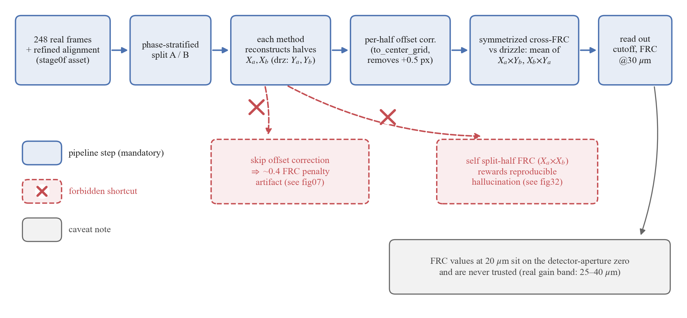

**本章总纲：修复后的“判据管线”流程图——所有神经×经典比较必须走的路。** 强制步骤为逐半偏移校正（去除 +0.5 HR px 网格约定）后再算对 drizzle 的 cross-FRC；两条捷径被明令禁用：自分半 FRC（奖励幻觉）与跳过偏移校正；20µm 孔径零点永远不采信。

*Script: `scripts/fig92_criteria_pipeline.py` · Data: 纯示意（`research_log/algorithm_changelog.md` 速览块 #1-#4）*

### Fig 21 — Per-Frame Shift Error Was the Top Bottleneck

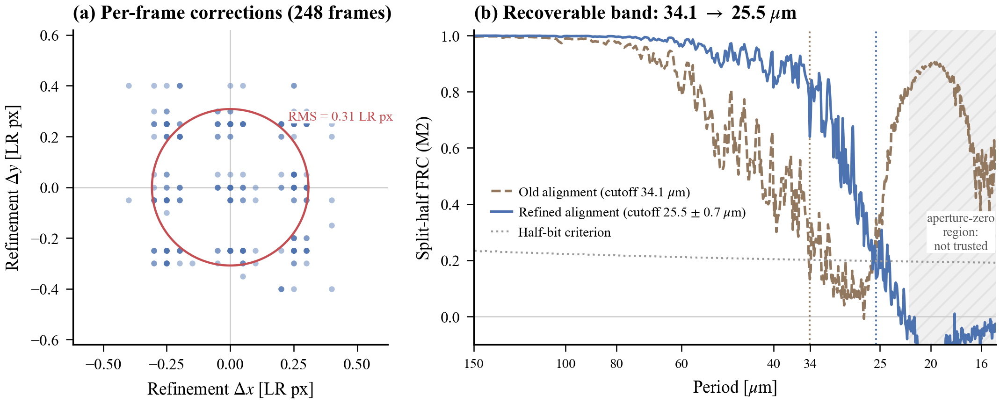

**头号信息瓶颈被找到并修复：逐帧对齐误差 ~0.31px。** (a) 精修对齐相对旧对齐的逐帧修正量散点（RMS 0.31px）；(b) 修复的直接回报——权威可恢复频带从 34.07µm 改善到 25.45±0.73µm。精修对齐自此成为仓库默认。

*Script: `scripts/fig21_shift_refinement.py` · Data: `remote_inbox/20260704_stage0f/`、`20260705_stage0g/` 相关 CSV（ACL-047/048）*

### Fig 32 — Same-Half Control: Self-FRC Hallucination Inflation

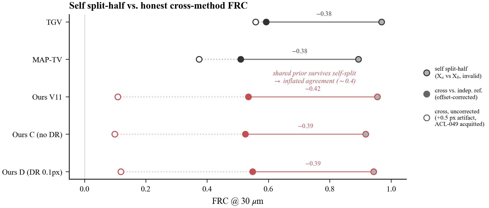

**为什么自分半 FRC 必须废弃：确定性网络的两个半幅会复现同样的幻觉。** 神经方法自分半 FRC 高达 0.92–0.96、与经典无异，但对独立 drizzle 的 cross-FRC 骤降至 ~0.10——差距被诚实拆为 ~0.4 幻觉膨胀 + ~0.4 配准伪影（后者见 fig07）两段。

*Script: `scripts/fig32_samehalf_control.py` · Data: `remote_inbox/20260703_stage1a/artifacts/task_e/method_summary.csv` + `20260704_stage0f/t2_frc_method_summary.csv` + stage0h 校正值（ACL-046/047/049）*

### Fig 63 — What Self Split-Half FRC Rewards

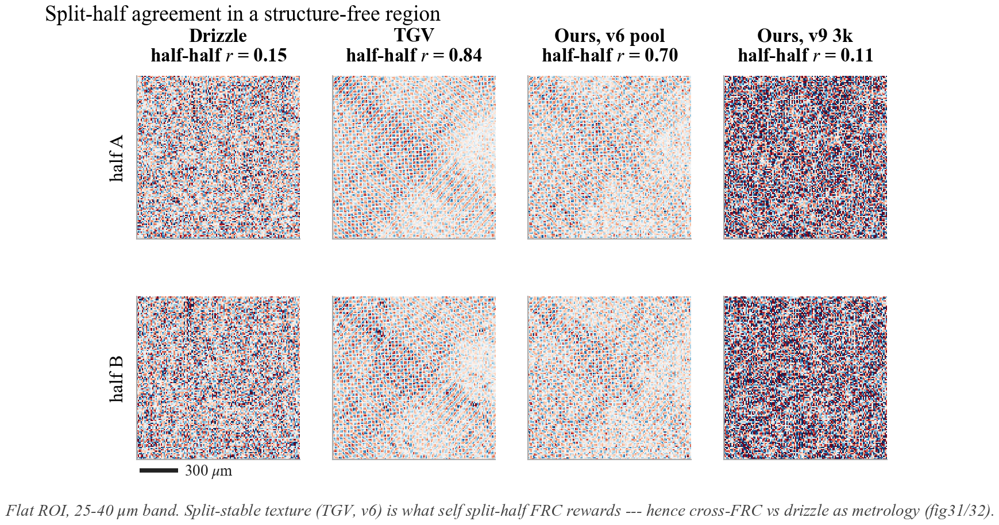

**fig32 的视觉版：自分半 FRC 到底奖励了什么样的“切分稳定纹理”。** 把平坦 ROI（不应有真实结构）带通到验收频带：TGV 两半相关 r=0.84、v6 臂 r=0.70——两半复现几乎相同的纹理；drizzle r=0.15 是诚实的噪声（v9-3k r=0.11 同样噪声化）。

*Script: `scripts/fig63_splithalf_flat_band.py` · Data: `remote_inbox/20260710_expab`（a/b 半幅重建，seed-42 相位分层切分；ACL 语境为 fig31/32 的分半对照）*

### Fig 31 — Drizzle Split-Half FRC Is Split-Choice Robust

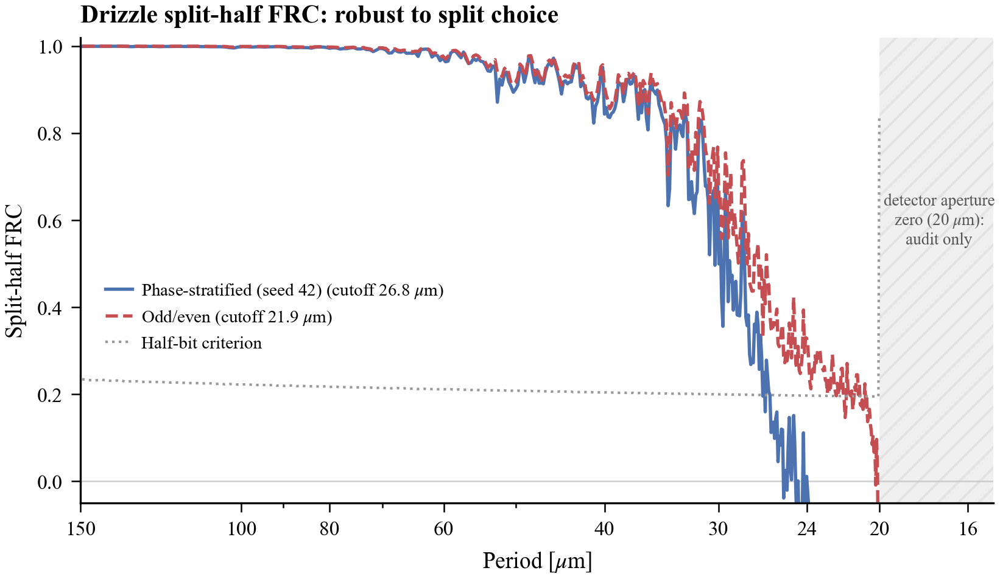

**对照组：独立参照 drizzle 自身对切分方式是稳健的，可以放心当 cross-FRC 的锚。** 奇偶帧切分与相位分层切分两种约定下，drizzle 分半 FRC 曲线在整个周期范围内重合。

*Script: `scripts/fig31_drizzle_split_controls.py` · Data: `remote_inbox/20260705_stage0g/drizzle_*_frc_curve.csv`、`task1_3_drizzle_frc_method_summary.csv`（ACL-048）*

### Fig 07 — The +0.5px Grid-Convention Artifact and Correction

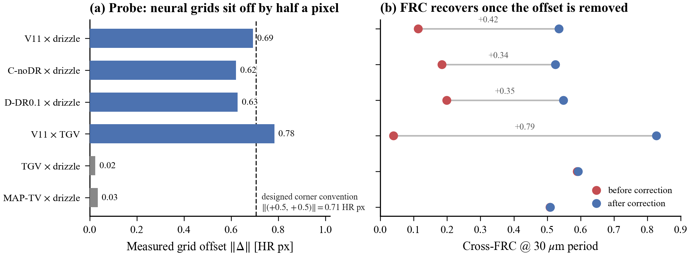

**本章最大的翻案：神经臂“带内破坏”其实是 +0.5px 网格约定伪影。** 探针实测神经×经典方法对之间偏移 0.6–0.8 HR px（经典对之间仅 0.03px）；扣除后 cross-FRC@30µm 大幅恢复（v11×TGV 0.04→0.83），带内符号翻转从 14 次降为 0。

*Script: `scripts/fig07_registration_artifact.py` · Data: `remote_inbox/20260713_dotprobe/offset_probe_summary_stage0h.csv`（ACL-049）*

### Fig 29 — Grid-Offset Probe Stability Across Eras

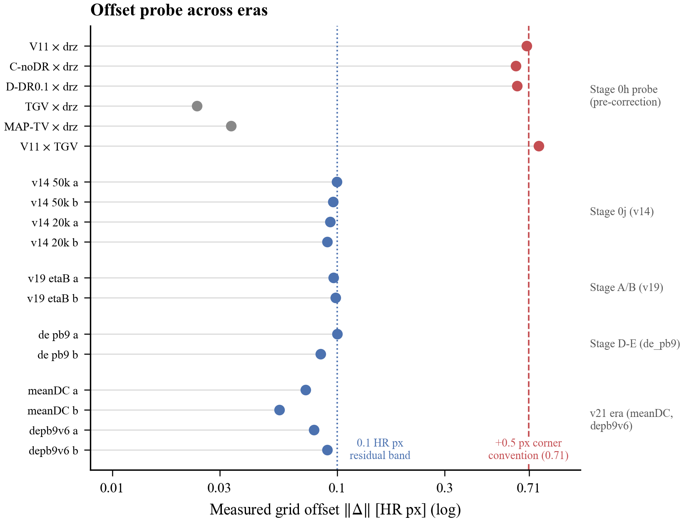

**校正入默认流程后，“尺子”在各时代持续保持在标。** stage0h 首测神经×经典偏移 0.6–0.8 HR px；此后 stage0j/v14、stage A/B、D-E、v21 各代探针残余全部 ≤0.10 HR px。

*Script: `scripts/fig29_offset_probe_stability.py` · Data: `remote_inbox/20260713_dotprobe/offset_probe_summary_{stage0h,stage0j,stageAB,stageDE,v21}.csv`（ACL-049+）*

### Fig 06 — Real-Data Cross-FRC Leaderboard

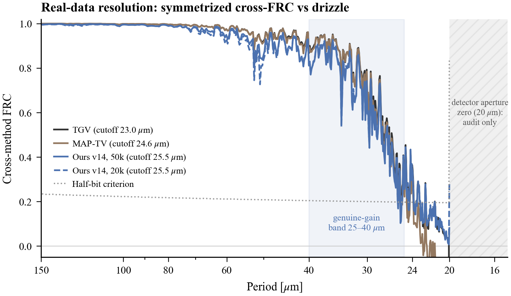

**本项目的权威真实域排行榜：精修对齐 + 网格校正口径下的跨方法 FRC 曲线。** TGV 0.7017@30µm / cutoff 23.03µm 是“要打败的对象”；阴影为 25–40µm 真实增益带，斜纹为 20µm 探测器孔径零点以下的不可信区。

*Script: `scripts/fig06_frc_leaderboard.py` · Data: `remote_inbox/20260708_stage0j/{frc_curves_long,method_summary}.csv`（ACL-047/048/049）*

### Fig 33 — Cross-FRC Band Table Across Methods

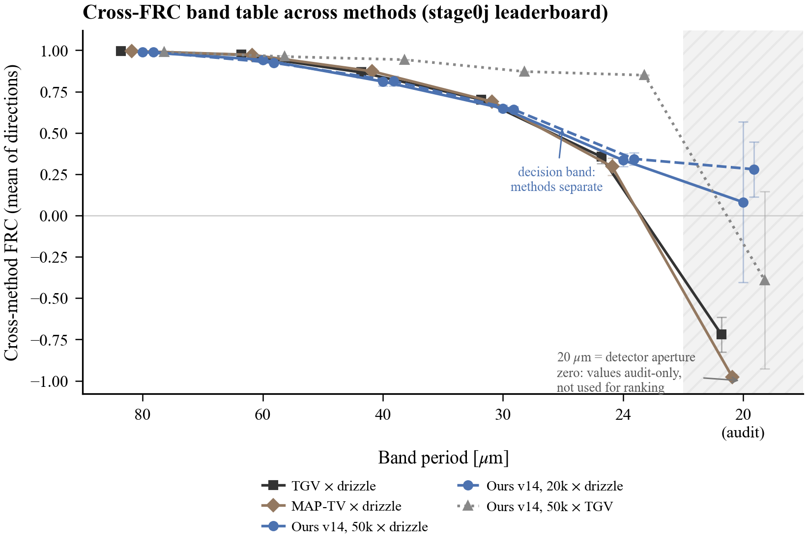

**排行榜的频带表视图：方法差异到底发生在哪个频段。** 各方法在 80–40µm 低频高度一致，真正分化发生在 30–24µm 决策频带；20µm 列两方向符号相反，不可用于排名。

*Script: `scripts/fig33_frc_band_table.py` · Data: `remote_inbox/20260708_stage0j/method_summary.csv`*

### Fig 34 — Sub-Pixel Phase Occupancy at 5x

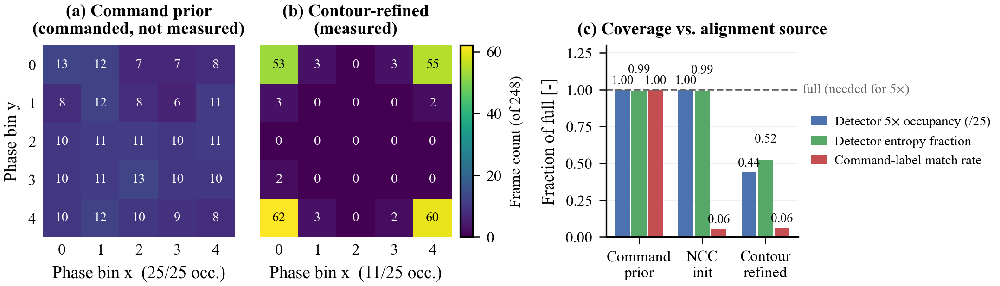

**“为什么只做 2x”的定量回答：实测相位占用不支撑更高倍率。** 舞台坐标上相位多样性充足（25/25 格），但真正喂给重建的探测器轴上，实测对齐只占 11/25 个相位 bin 且堆积在角落——>2x 存在相位饥饿。

*Script: `scripts/fig34_phase_occupancy.py` · Data: `remote_inbox/20260704_stage0f/t0e_m1_*.csv`（EP15-M1/ACL-048）*

### Fig 30 — Which 0D Regression Metrics Separate Good From Bad

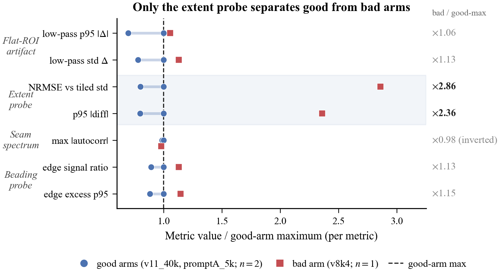

**0d 回归指标套件的可分性审计：只有 extent 探针配得上“硬门槛”。** extent 一致性探针以 2.4–2.9× 边界区分已知好坏臂；flat/beading 边界与好臂内部离散度相当，seam 探针方向甚至反了——应退役或重设计。

*Script: `scripts/fig30_regression_metric_separability.py` · Data: `remote_inbox/20260704_stage0f/t3_regression_metric_{values,separability}.csv`（ACL-046/047）*

---

## 第三章 重建算法演化：从 UNet 到物理展开 solver

主线架构决策（ACL-024）：不上 diffusion、不用现成底子，自研**物理约束展开 solver**。本章按时间排列这条演化线：v4 loss/指标重设计后的收敛条带（fig28）；solver 与残差 UNet 基线的对比——solver 5k 步即锐利而 UNet 需 15k+（fig12，训练动力学 fig05）；drizzle 暖启动引入的 2 px waffle 棋盘伪影的根因与修复（fig26）。随后是一场教科书式的"发现伪影 → 频谱定位 → 机制证明 → 工程缓解"攻坚：K4 发光框伪影步分解（fig22）、频谱诊断锁定瓦片步长（fig25）、根因 = GroupNorm+SE 破坏范围不变性——随机初始化因果实验证明（fig24），促成 noSE+noGN 主线，配合 halo=96 外圈推理缓解（fig23）；该时代的训练诊断与推理演化存档见 fig15/fig64。D-E 高频残差线七臂全阴性、如实归档（fig27）。真正移动指针的是 **η（DC 权重）重校准**——历史默认 0.5 从未校准过，η\*=0.09 一举缩小 35% 的 TGV 差距，而各种扩容路线全部平盘（fig14）。最后 v21 收敛扫描确认冠军配方 20k 步后成熟趋平台，而 meanDC 基线 15k 后灾难性发散（fig17）。

| 图 | 内容 | 关键结论 |
|---|---|---|
| fig28 | v4 时代 checkpoint 条带 | 真实共享色标；2.5k 步已基本收敛 |
| fig12 | solver vs UNet checkpoint 条带 | solver 5k 步即锐利，UNet 需 15k+ |
| fig05 | 训练动力学六面板 | 同一评测钩子下 solver / UNet 全指标对比 |
| fig26 | de-waffle 暖启动修复 | 2 px 棋盘伪影根因与修复；grid score 0.404→0.000 |
| fig22 | K4 发光框根因分解 | prox 分块边界伪影随展开步数累积 → K2 主线 |
| fig25 | seam 频谱诊断 | 网格分量锁定瓦片步长 32 px；halo 后突出度降 16× |
| fig24 | 范围不变性因果实验 | GN 0.67 / GN+SE 1.41 vs 纯卷积 0 → noSE+noGN 主线 |
| fig23 | halo 扫描 | halo=96 抑制伪影；墙钟/显存成本可控 |
| fig15 | V8/K4 训练诊断存档 | 冻结 η/退火设计的六面板仪表盘 |
| fig64 | halo=96 推理随训练演化 | 5k/20k/40k 温度 + 高通细节蒙太奇 |
| fig27 | D-E prox 高频残差臂 | 七臂全阴性（PSNR ~32.5 < V11 35.17），如实归档 |
| fig14 | η（DC 权重）校准 | η\*=0.09；合成/真实解耦；唯一真正移动指针的旋钮 |
| fig17 | v21 收敛扫描 | depb9v6 20k 后平台；meanDC 15k 后灾难发散 |

### Fig 28 — v4-Era Checkpoint Strip

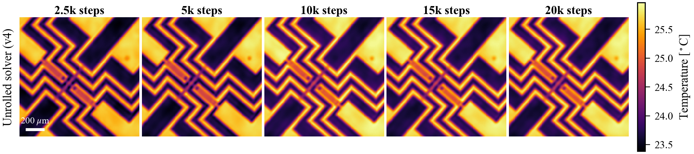

**solver 世代的起点：ACL-027 loss/指标重设计后，v4 solver 2.5k 步已基本收敛。** 直接读取全帧温度 .npz、共享真实摄氏色标的单臂训练条带（2.5k–20k 步），比逐图自动标定的 TensorBoard 导出更诚实。

*Script: `scripts/fig28_v4era_checkpoint_strip.py` · Data: `remote_inbox/20260627_checkpoint_evolution/solver_v4_acl027/solver_step*_temperature_c.npz`（ACL-027/029）*

### Fig 12 — Checkpoint Evolution Strip (Solver vs UNet)

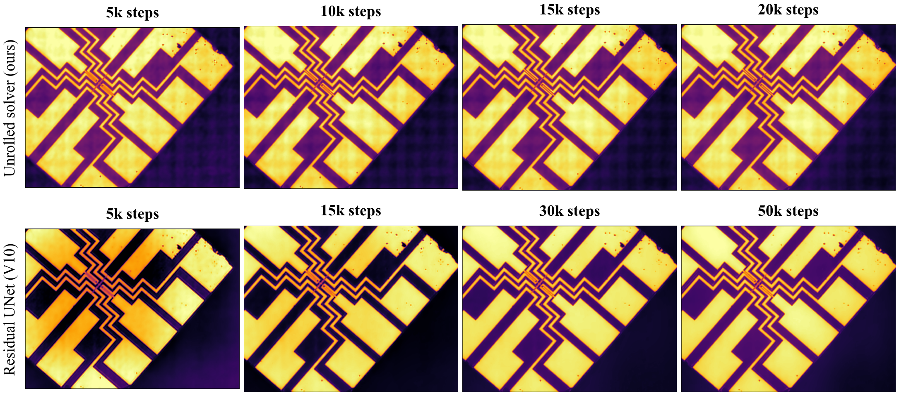

**物理展开 solver 对 UNet 的效率优势一图可见：5k 步即锐利 vs 15k+ 步。** 同一真实中心细节区（3x 放大）双行条带：solver（5k–20k 步）与残差 UNet V10（5k–50k 步）。

*Script: `scripts/fig12_checkpoint_evolution_strip.py` · Data: `remote_inbox/20260627_checkpoint_evolution/20260628_hybrid_solver/eval_real_png/`（ACL-029 时代）*

### Fig 05 — Training Dynamics: Unrolled Solver vs UNet

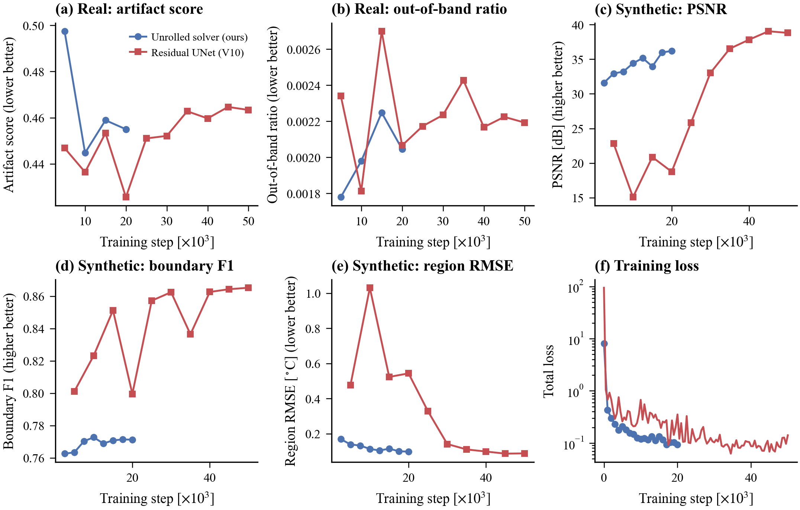

**fig12 的训练动力学配套：同一评测钩子下 solver 与 UNet 的六面板标量对比。** 覆盖真实域伪影分数/带外比、合成域 PSNR/边界 F1/区域 RMSE 与总训练损失（ACL-029 时代）。

*Script: `scripts/fig05_training_dynamics.py` · Data: `remote_inbox/20260627_checkpoint_evolution/20260628_hybrid_solver/{solver_v5_sharp_hybrid,v10_v5_sharp}_scalars.csv`（ACL-029 时代）*

### Fig 26 — De-Waffle Warm Start

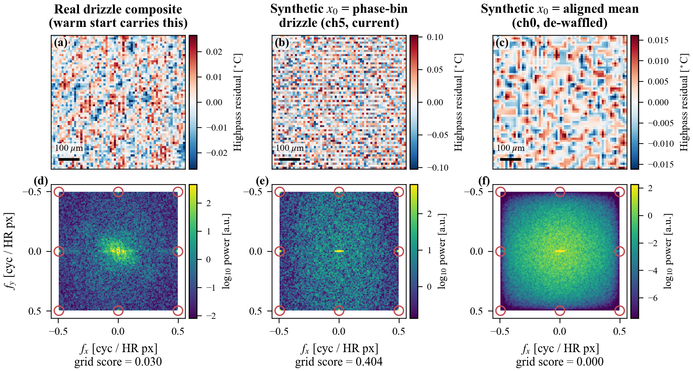

**一次典型的伪影根因修复：drizzle 暖启动带入的 2px 棋盘 waffle。** 相位覆盖不均的 drizzle 在平坦区产生周期 2 HR px（=1 探测器像元）的棋盘纹并残留到 solver 输出；把暖启动源换成融合对齐均值后 Nyquist 峰消失（grid score 0.404→0.000）。

*Script: `scripts/fig26_dewaffle_x0.py` · Data: `remote_inbox/20260716_v8_verdict/drizzle_a.npy` + 合成场景（ACL-032）*

### Fig 22 — K4 Glow-Box Artifact Root Cause

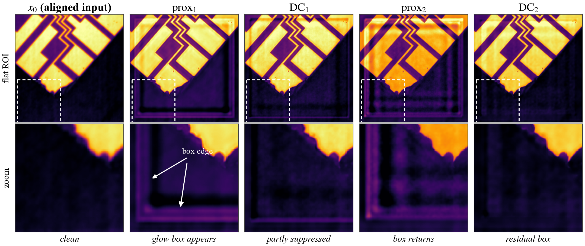

**K4 发光框伪影的现场：学习 prox 在分块边界注入方形伪影并随展开步数累积。** x0→prox1→DC1→prox2→DC2 步分解直接可见、DC 步只能部分抑制——促成 K2 主线 + halo 评测方案（TB 导出，定性展示）。

*Script: `scripts/fig22_k4_box_artifact.py` · Data: `research_log/episodes/ep07_solver_boundary_artifact/figures/05_step_decompose_temp_x0_prox1_dc1_prox2_dc2.png`（ACL-037 时代）*

### Fig 25 — Tile-Seam Spectral Diagnostic

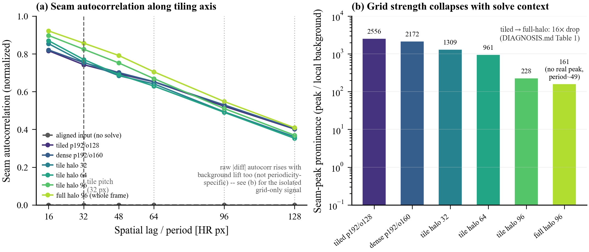

**频谱证据：网格伪影锁定在瓦片步长上，随求解上下文扩大单调塌陷。** 峰值突出度从 tiled 到 full_halo96 下降约 16 倍（2556→161），周期始终为瓦片间距 32 HR px；网格消失后峰不再有锚定。

*Script: `scripts/fig25_seam_spectrum.py` · Data: `outputs/ep07_solver_diag/metrics_arrays*.json`（原始渲染数组已不在本地，本图基于已归档标量/采样汇总重建，ACL-037/038）*

### Fig 24 — GroupNorm+SE Break Extent-Invariance

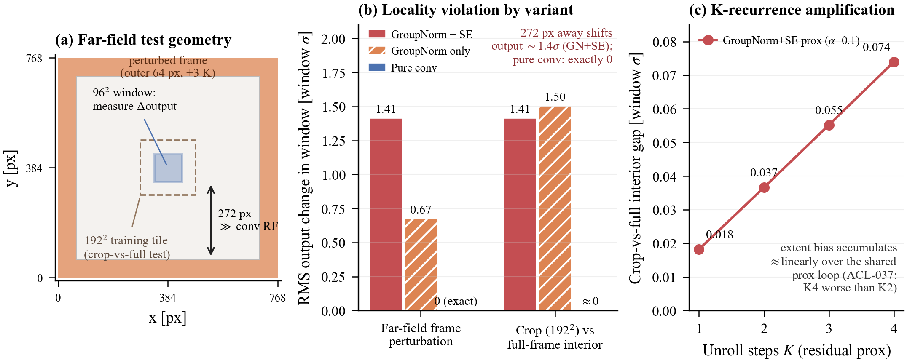

**根因实锤（随机初始化因果实验）：GroupNorm+SE 破坏“范围不变性”。** 272px 远场扰动下纯卷积响应 0、仅 GN 0.673、GN+SE 1.412，且残差 prox 循环使差异随 K 近似线性放大——从第一性原理复现“K4 比 K2 差”，促成 noSE+noGN 主线架构。

*Script: `scripts/fig24_extent_invariance.py` · Data: `outputs/ep07_solver_diag/metrics_extent.json`（由 `diag_extent.py` 生成并二次验证，ACL-037/040/041）*

### Fig 23 — Outer Halo Sweep Suppresses Glow-Box

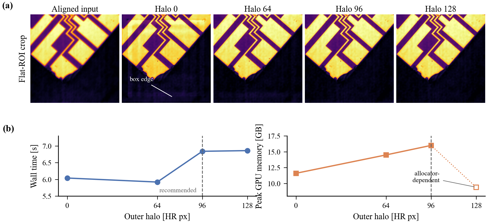

**工程缓解定档：halo=96 外圈上下文抑制发光框，成本可控。** halo 0/64/96/128 条带显示 96 已抑制、128 无额外可见收益；RTX 5090 全帧推理墙钟/显存成本随 halo 变化（halo128 显存读数为分配器复用效应，空心标记）。

*Script: `scripts/fig23_halo_sweep.py` · Data: `research_log/episodes/ep07_solver_boundary_artifact/figures/08_flatroi_halo_temp_aligned_halo0_64_96_128.png` + `data/halo_sweep.csv`（ACL-038）*

### Fig 15 — V8/K4 Full-Halo Solver Training Diagnostics

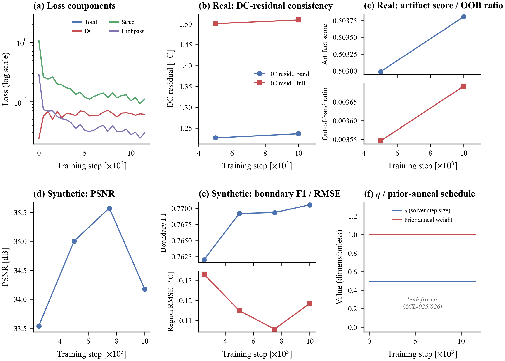

**攻坚时代的训练诊断存档：V8/K4 full-halo 运行的六面板仪表盘。** 该 checkpoint 采用冻结 η=0.5、冻结先验退火的训练设计（loss/total 与 loss/struct 逐位相同属权重设计使然），是 fig24 范围不变性调查的诊断对象之一。

*Script: `scripts/fig15_solver_training_diagnostics.py` · Data: `research_log/episodes/ep07_solver_v8_k4_fullhalo_eval_archive/scalars/*.csv`（ACL-040/041 时代）*

### Fig 64 — Training-Step Evolution of the Halo=96 Full-Frame Solve

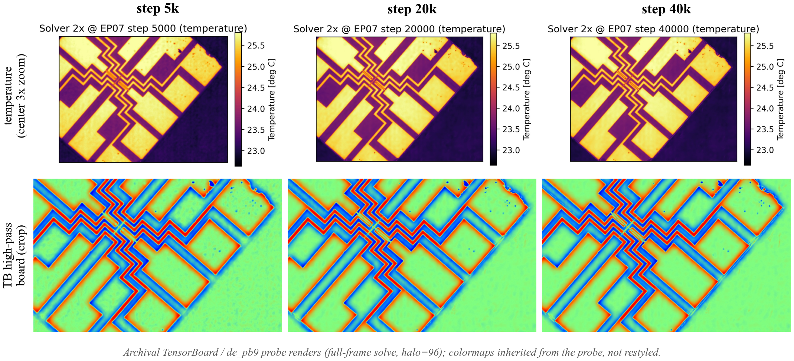

**halo=96 全帧推理下重建随训练步数的演化存档。** 5k/20k/40k 步的中心 3x 温度渲染（探针原生输出）+ 裁剪像素完全一致的 TB 高通细节，逐步可比（存档 JPG 原样，仅裁剪展示）。

*Script: `scripts/fig64_halo_training_zoom.py` · Data: `output/de_pb9_probe/solver_step{5000,20000,40000}_full_halo96_center_zoom3x_temperature.jpg` + `tb_highpass_step*.jpg`（de_pb9 探针时代，2026 年 7 月初）*

### Fig 27 — D-E Prox High-Frequency-Residual Arms

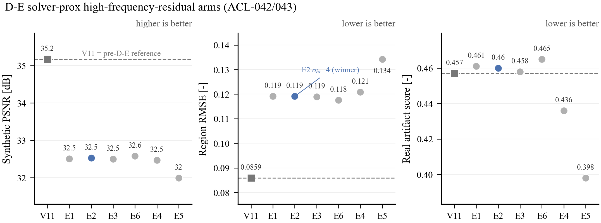

**诚实归档的阴性结果：D-E“高频残差 prox”七臂全部未达 V11 水平。** 各臂合成保真 PSNR ~32.5 vs V11 的 35.17；E2（σ_hr=4）被判“最均衡”，但整条路线结论为负。

*Script: `scripts/fig27_de_prox_arms.py` · Data: `data/de_prox_arms.csv`（ACL-042/043）*

### Fig 14 — DC-Weight (eta) Calibration

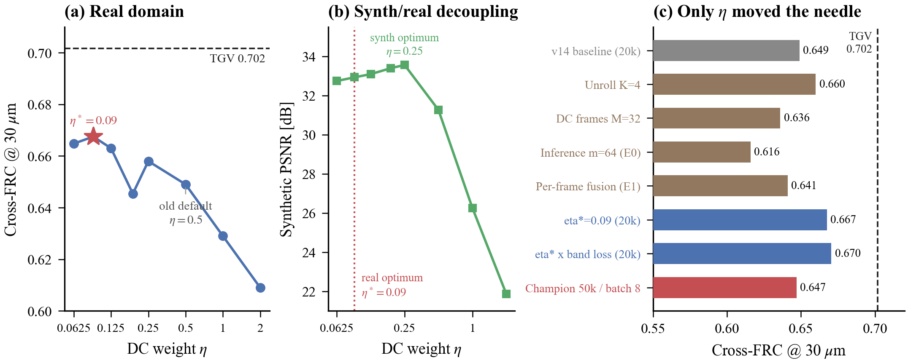

**第三章真正移动指针的一步：η（DC 权重）从历史默认 0.5 重校到 η*=0.09。** 真实域 cross-FRC 随 η 单调改善至平台；合成域最优（0.25）与真实最优（0.09）解耦；记分板显示各扩容路线全部平盘，唯有 η 重校准缩小约 35% 的 TGV 差距，50k 过训反而回退。

*Script: `scripts/fig14_eta_calibration.py` · Data: `data/eta_sweep.csv`、`data/plateau_scoreboard.csv`（ACL-051/052/053）*

### Fig 17 — v21 Checkpoint Convergence Sweep

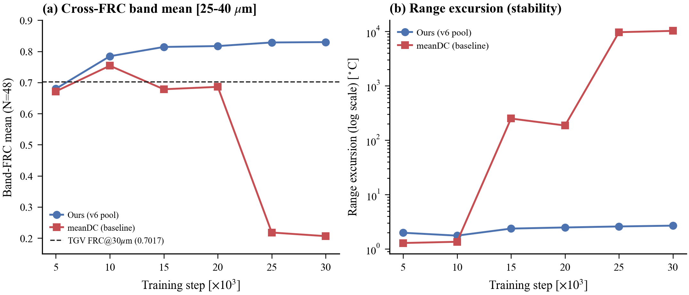

**冠军配方的收敛证书：20k 步后单调成熟趋平台，对照臂 meanDC 灾难性发散。** depb9v6 频带 FRC 20k→30k 漂移 <2%、range_excursion 稳定在 2–2.7；meanDC 自 15k 步起 range_excursion 从 ~1.4 爆升至 >10000——早期表现相近不能预测后期行为。

*Script: `scripts/fig17_v21_convergence.py` · Data: `output/v21_eval/v21_convergence_table.csv`*

---

## 第四章 合成训练数据引擎 TCForge

真实数据只有一个 248 帧会话、没有 HR 真值，监督信号必须来自合成。TCForge 程序化"语法"生成 5000 景规模的训练池：每景输出 HR 真值温度场、LR 前向观测与覆盖掩膜（fig67）；场景涵盖多面板装配、遮挡与热缺陷（fig20）；缺陷体系分五族注入（fig42）；G1–G8 质量门审计把关每次建池（fig41）。训练池的代际演化（v6→v7→v8→v9→v9-3k）及其对点保真的深远影响，是第五章的主题。

| 图 | 内容 | 关键结论 |
|---|---|---|
| fig67 | 训练场景解剖 | 每景 = HR 真值 / LR 观测 / 覆盖掩膜三场 |
| fig20 | 合成场景画廊 | 生产训练池实际内容一览 |
| fig42 | 缺陷五族特写 | 小暗点 / 热点 / 暗斑 / 边缘缺口 / 断裂走线 |
| fig41 | 质量门审计 | G1–G8 小倍数图；G5 对比度 1.45×<1.5× 如实展示 |

### Fig 67 — Anatomy of a Synthetic Training Scene

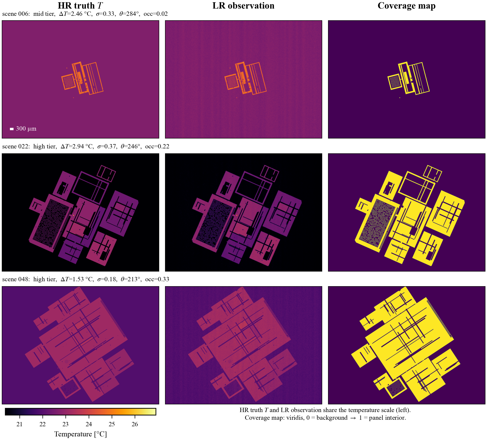

**合成监督的最小单元：每个训练场景由哪三个栅格场构成。** HR 真值温度 T、共享色标的 LR 前向观测（可直接读出模糊/降采样的对比度损失）、软面板覆盖掩膜 cov；三个场景分别代表池内最稀疏布局、最大热波动、最密集布局。

*Script: `scripts/fig67_synth_scene_anatomy.py` · Data: `outputs/v7_demo_minipool/scene_NNN.npz`（v7 时代示例池，`scripts/generate_v7_demo_minipool.py` 生成）*

### Fig 20 — v7 TCForge Synthetic Scene Showcase

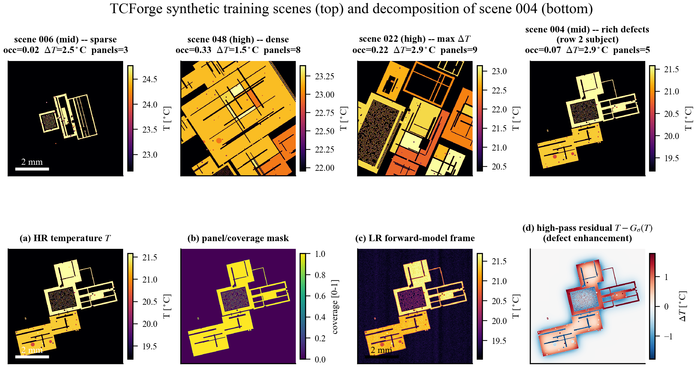

**生产训练池实际长什么样：多面板装配、遮挡、几何与热缺陷的画廊。** 上排 4 个手选 HR 真值场景跨越池的结构范围；下排单景分解（HR 温度/覆盖掩膜/LR 单帧观测/高频残差缺陷增强）。

*Script: `scripts/fig20_synthetic_showcase.py` · Data: `outputs/v7_demo_minipool/scene_0NN.npz` + `index.json`（ACL-065）*

### Fig 42 — Composer Defect-Family Showcase

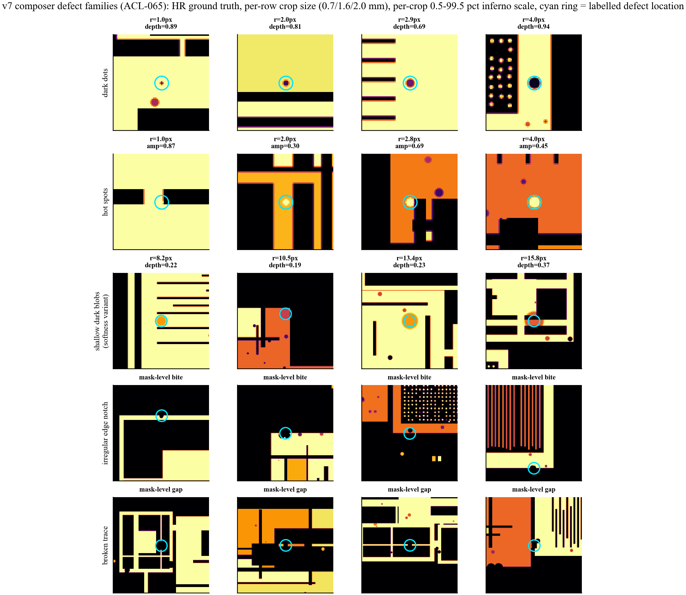

**缺陷体系五族特写——第五章点保真攻坚的“陪练对象”。** 小暗点/热点/浅色暗斑/边缘缺口/断裂走线逐行展示、青圈标注精确位置；由生成器现场运行采样，每族裁剪窗口按缺陷尺度单独设置。

*Script: `scripts/fig42_composer_defect_showcase.py` · Data: `scripts/v7_composer_demo.py`（现场运行，ACL-065）*

### Fig 41 — Composer Quality-Gate Audit

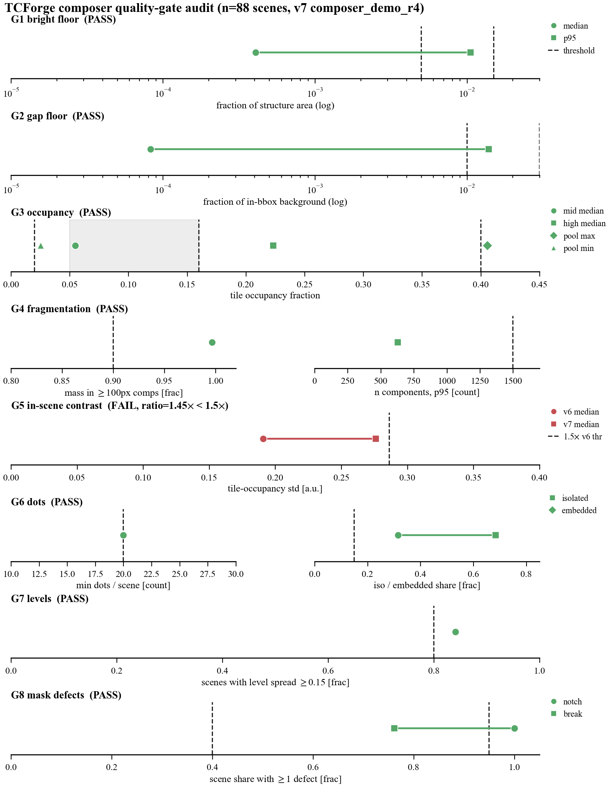

**建池不是随手生成：G1–G8 质量门审计把关每次生产。** 小倍数图分别展示每个门自己的统计量与阈值线；G5 对比度检查以 1.45×<1.5× 未通过、如实展示。

*Script: `scripts/fig41_gate_audit.py` · Data: `research_log/assets/v7_planning/composer_demo_r4/gate_audit.json`（v7 composer 门定义相关 ACL 条目）*

---

## 第五章 点保真攻坚与训练池演化

对工业检测而言，**"小暗缺陷点是否被保留"是不可妥协的轴**——一个被算法抹掉的缺陷点就是一次漏检。真实域 3562 点探针（fig36）量化出所有神经臂都不同程度衰减小而暗的缺陷（fig09，连续版 fig37），且该差异无法用配准/增益漂移解释、是真实的模型差异（fig38）。v7 池灾难（孤立点抹除率 43%）触发系统归因链：L1 零训练审计证伪"点物理不可见"假设、精确定位病理角落 = 小半径×浅深度（fig35）；300 景微标定发现抹除先验需要池规模级数据多样性才会形成（fig08，配套视觉 fig39/fig65）。修复严格按归因执行：v8 收紧深度下限、v9 恢复密度，孤立点抹除率 43% → 4.35% → 1.55% → 0.00% 逐代收复（fig01，六个真实缺陷点的直接视觉追踪 fig62）；未决异常 range_excursion 如实挂账（fig40）。本章末尾是一个重要的方法学产出：**DC 残差自审计**——被抹除的点在留出数据一致性残差中留下可检测的痕迹（fig04，统计量选型 fig47，空间核验 fig46，直观展示 fig61），模型"骗不过"物理一致性，这构成零训练的部署侧自我怀疑仪表。

| 图 | 内容 | 关键结论 |
|---|---|---|
| fig36 | 点探针检出漏斗 | 3D 候选逐级筛到 N=3562 探针集 |
| fig09 | 保真率分层 | 失效集中在"小 + 浅 + 孤立角落" |
| fig37 | retention vs 直径连续曲线 | 42 个光学显微验证点落在同一趋势线 |
| fig38 | 臂间校准 vs 保真 | 配准/增益紧凑聚集，保真差异是真实模型差异 |
| fig35 | L1 可检测性审计 | "物理不可见"证伪；病理角落占比 55%→22% |
| fig08 | 抹除先验涌现 | 300 景全程 0% vs 5000 景 39.75%——池规模效应 |
| fig39 | 微型臂端点视觉 | 300 景臂结构合理、零抹点、偏软 |
| fig65 | v7 训练时长视觉演化 | 12k–24k 步细节差异 |
| fig01 | 训练池五代演化总图 | 抹除率 43%→4.35%→1.55%→0.00% |
| fig62 | 抹点传奇视觉版 | 6 个孤立缺陷点跨代追踪：抹掉 → 逐代找回 |
| fig40 | range_exc 未决异常 | v8/v9 代 12–16 vs 健康带 1.6–4.4，机制未明 |
| fig04 | DC 残差自审计 | 被抹点可检出 AUC 0.68–0.84，随臂保真度单调 |
| fig47 | 残差统计量选型 | 窗口最大值类完胜均值类——点状局部峰物理图像 |
| fig46 | 残差空间图核验 | 139 个被抹点位置精确核验，AUC 0.887 |
| fig61 | 残差图直观展示 | 被抹的点在留出残差中"重新显形" |

### Fig 36 — Dot-Probe Detection Funnel

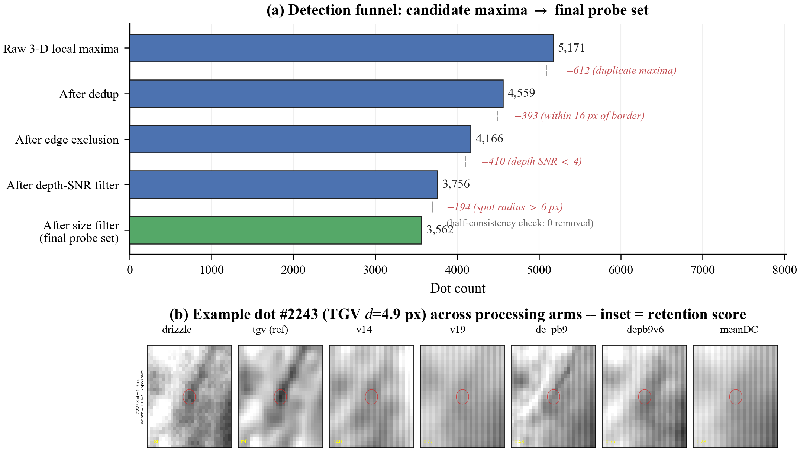

**本章的测量工具：真实域点探针如何从候选筛到可信集合。** 检测瀑布从 5171 个 3D 局部极大值候选，经去重/边缘剔除/深度 SNR 门槛/半幅一致性/尺寸筛选得到 N=3562 探针集；右侧为单点跨 7 臂对比条带示例。

*Script: `scripts/fig36_dot_probe_funnel.py` · Data: `output/dot_probe/detection_funnel.json`、`summary.md`、`board_crops.png`（ACL-063）*

### Fig 09 — Dot-Probe Retention Stratified by Size/Depth/Isolation

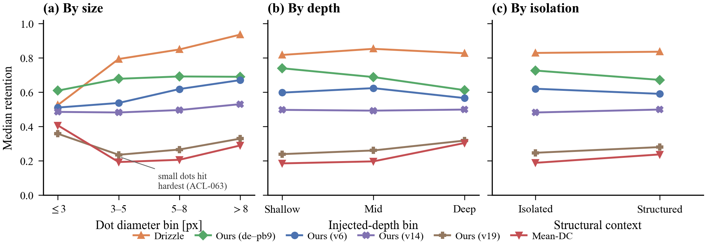

**失效发生在哪里：神经臂的点衰减集中于“小 + 浅 + 孤立角落”。** 按点尺寸、深度、孤立度三维分层的中位数保真率，使失效模式直接可见，而非被单一均值平均掉（ACL-063 确立所有神经臂衰减小暗缺陷）。

*Script: `scripts/fig09_dot_probe_stratified.py` · Data: `output/dot_probe/summary_by_arm_{size,depth,isolation}.csv`（ACL-063）*

### Fig 37 — Continuous Retention vs Dot Size

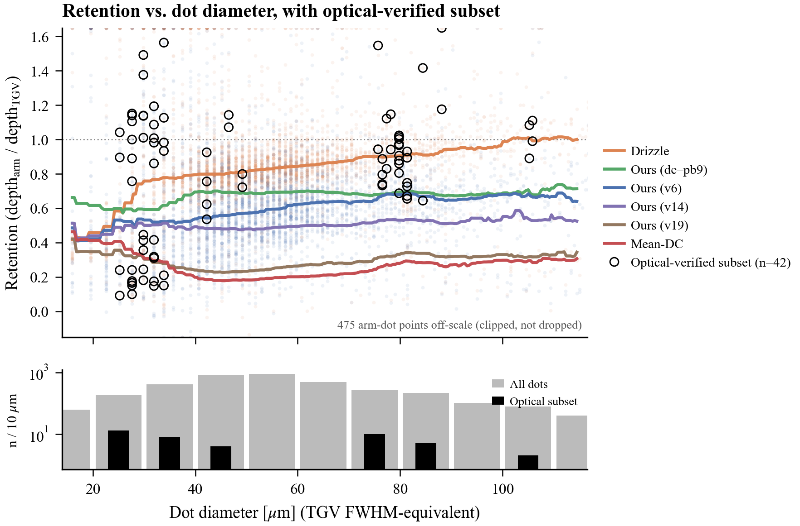

**fig09 的连续版 + 独立验证：42 个光学显微匹配点落在同一趋势线上。** 逐点滑动中位数保真率 vs 点直径（drizzle 平坦、depb9v6 明显衰减），底部密度条给出逐 bin 样本支撑——小点衰减不是合成拟合管线的伪影。

*Script: `scripts/fig37_retention_vs_size.py` · Data: `output/dot_probe/per_dot.csv`、`optical_subset.csv`（ACL-063）*

### Fig 38 — v22-Era Arm Calibration on the Dot Probe

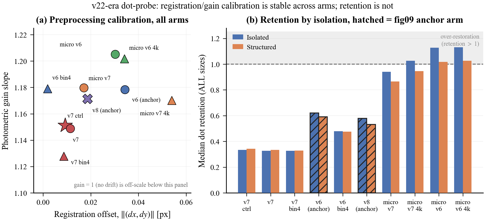

**排除法：臂间保真差异不是配准/增益漂移能解释的，而是真实的模型差异。** 10 个臂的光度增益/亚像素偏移高度聚集（斜率 1.13–1.21、偏移 <0.06px），中位点保真率却从 0.33 拉开到 1.13。

*Script: `scripts/fig38_v22_arms_probe.py` · Data: `output/dot_probe_v24ctrl/`、`remote_inbox/20260716_micro_calib/probe_out/`、`20260716_v8_verdict/probe_out/`（ACL-067/069/070）*

### Fig 35 — L1 Zero-Training Detectability Audit

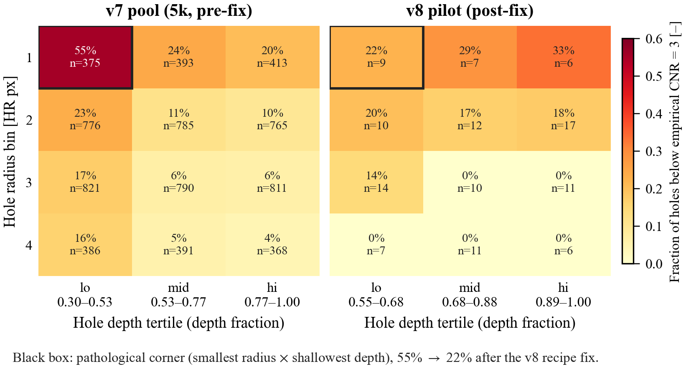

**v7 病理的第一层归因：L1 零训练审计证伪“点物理不可见”，精确定位病理角落。** 半径 ~1 HR px × 最低深度三分位处，55% 的 v7 空洞 CNR<3；v8 试点池按此门控（收密度、抬深度下限）后降到约 22%。

*Script: `scripts/fig35_l1_detectability_corner.py` · Data: `remote_inbox/20260713_l1audit/{v7_5k,v8_pilot}/`（ACL-068/070）*

### Fig 08 — Dot-Erasure Prior Needs Pool Scale

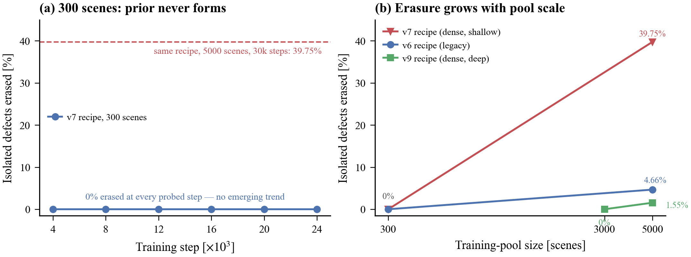

**v7 病理的第二层归因：抹除先验是池规模效应，不是步数效应。** 300 景 v7 配方从 4k 到 24k 步全程 0% 抹除，同配方 5000 景池 30k 步已达 39.75%——小池靠记忆、大池才泛化出“抹除小暗点”先验；池规模本身是权衡旋钮。

*Script: `scripts/fig08_prior_emergence.py` · Data: `remote_inbox/20260716_micro_{calib,horizon}/summary_micro.json` + `data/prior_emergence.csv`（ACL-062/067/069/072/074）*

### Fig 39 — 300-Scene Micro-Arm Endpoint Visuals

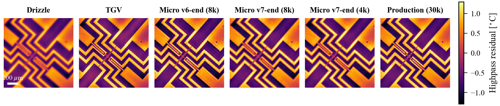

**fig08 的视觉配套：300 景微型臂结构合理、零抹点，只是更软。** drizzle / TGV / 微型臂（4k–8k 步）/ 生产臂（30k 步）的中心细节高通对比条带，复用 fig10 的显示变换。

*Script: `scripts/fig39_micro_endpoint_visuals.py` · Data: `remote_inbox/20260716_micro_calib/*.npy`（ACL-069）*

### Fig 65 — v7 Training-Horizon Visual Evolution

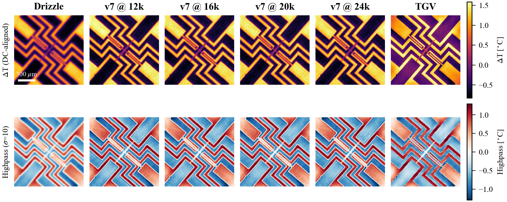

**v7 时代训练时长的视觉扫描：12k–24k 步的细节演化 vs 经典锚点。** 一个精细蛇形走线 ROI 的双行对比（类温度 + 匹配高通，与 fig10 口径一致），显示训练推进带来的细节差异。比例尺 300µm。

*Script: `scripts/fig65_v7_horizon_visuals.py` · Data: `remote_inbox/20260716_micro_horizon/*.npy`（v7 时代微型训练时长判决，约 ACL-060s）*

### Fig 01 — Pool Evolution: Dot-Fidelity Saga Across Generations

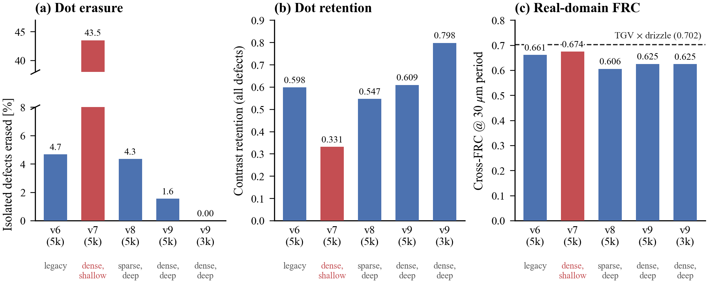

**五代训练池演化的总图：点保真危机与逐代收复。** (a) 孤立点抹除率：v7 病理 43%（断轴）→ v8 4.35% → v9 1.55% → v9-3k 0.00%；(b) 全体点保真率；(c) 真实域 cross-FRC——三轴并排，暴露每一代的得与失。

*Script: `scripts/fig01_pool_evolution.py` · Data: `data/pool_evolution.csv`（ACL-066/070/071/072/074）*

### Fig 62 — The Dot-Erasure Saga, Seen Directly in the Reconstructions

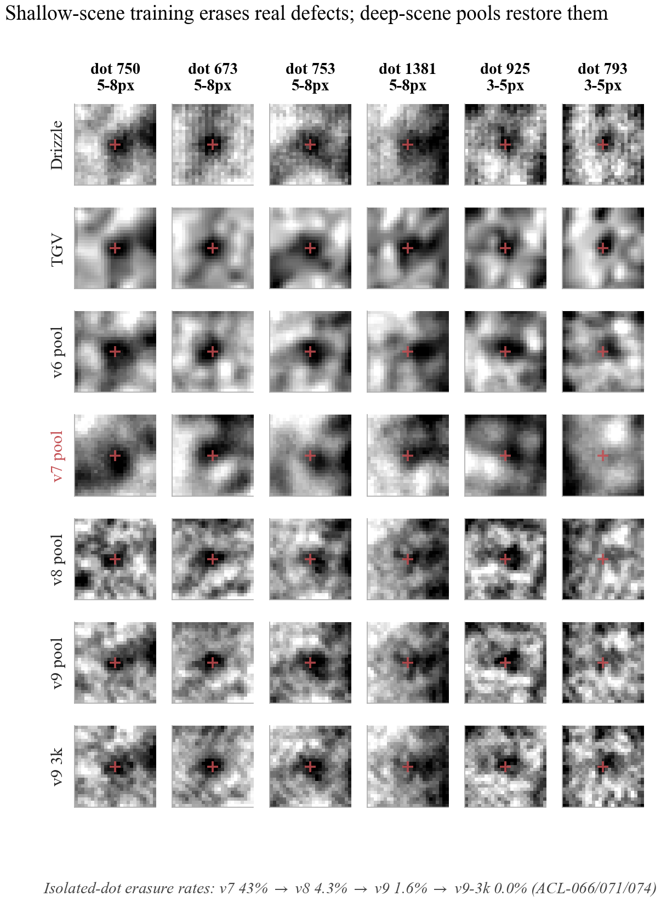

**同一个故事让人亲眼看见：6 个真实缺陷点被 v7 抹掉、又被 v8/v9/v9-3k 逐代找回。** 所选点均为孤立、drizzle 中清晰可见、被 v7 臂抹除者（抹除率 43% → 4.3% → 1.6% → 0.0%）；25×25 HR px 裁剪，十字准星标注目录点位。

*Script: `scripts/fig62_erasure_saga_visual.py` · Data: `remote_inbox/{20260710_expab,20260713_dotprobe,20260716_v8_verdict}` 重建 + `output/dot_probe_v7/intermediate/per_dot_v22_arms.csv`（ACL-066/071/074）*

### Fig 40 — The Unresolved Range-Excursion Anomaly

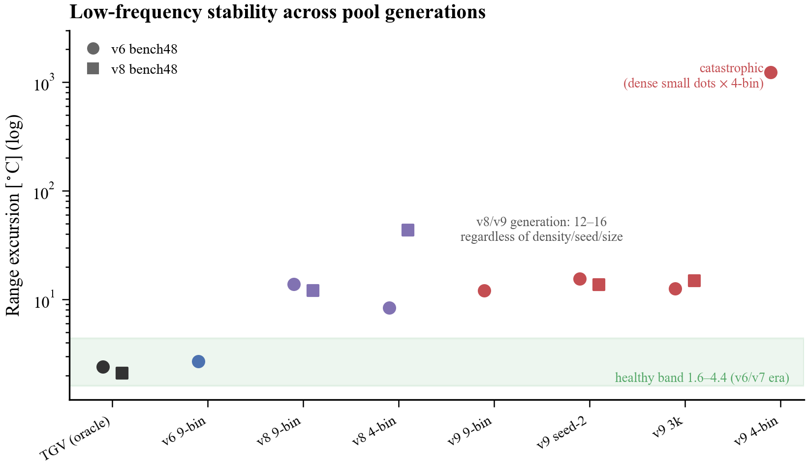

**诚实挂账的未决异常：v8/v9 代 range_excursion 系统性偏高。** 所有 v8/v9 代 9-bin 臂稳定落在 12–16（健康带 1.6–4.4），与缺陷密度/种子/池规模无关，共同因素疑似深度配方；v9 4-bin 配方灾难性发散至 ~10³ 出局。机制尚未查明。

*Script: `scripts/fig40_range_exc_anomaly.py` · Data: `data/range_exc_by_generation.csv`（ACL-062/071/072/074）*

### Fig 04 — DC-Residual Self-Doubt Gauge

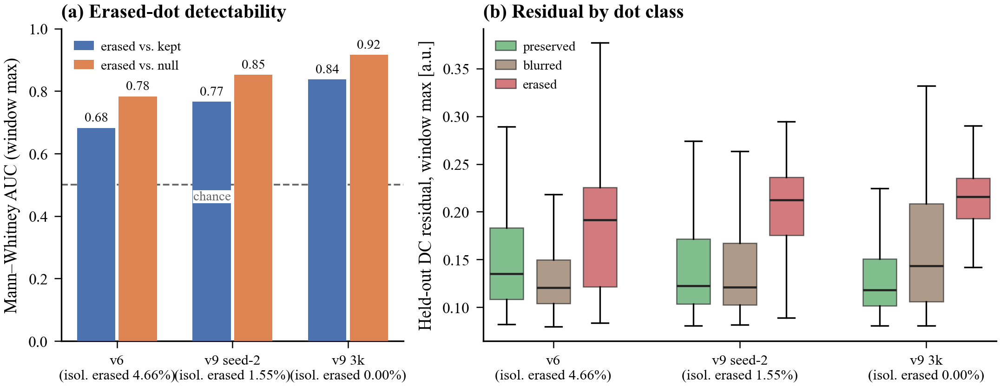

**本章的方法学产出：被抹除的点在留出 DC 残差中留下可检测的痕迹——模型骗不过物理一致性。** 各臂 Mann-Whitney AUC 0.68–0.84，且检测能力随臂的点保真度单调增强；这构成零训练即可部署的“自我怀疑仪表”。

*Script: `scripts/fig04_dc_residual_audit.py` · Data: `output/dc_residual_confidence/{auc_table,per_dot_residual_stats}.csv`（ACL-075）*

### Fig 47 — Which Residual Statistic Detects Erased Dots

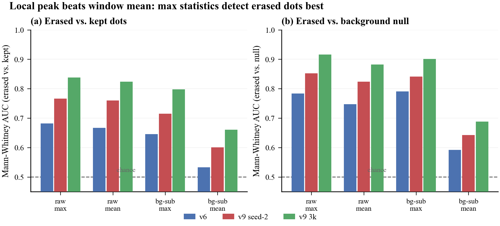

**为什么选“窗口最大值”做检测统计量：抹除信号是点状局部峰。** 四种候选统计量的 AUC 对比显示最大值类在每个臂上都优于均值类、不扣背景的原始窗口最大值整体最佳——与“缺失点源经前向算子留下局部化足迹”的物理图像一致。

*Script: `scripts/fig47_dc_residual_stats.py` · Data: `output/dc_residual_confidence/auc_table.csv`（ACL-075）*

### Fig 46 — Where the Self-Doubt Gauge Fires (Spatial Map)

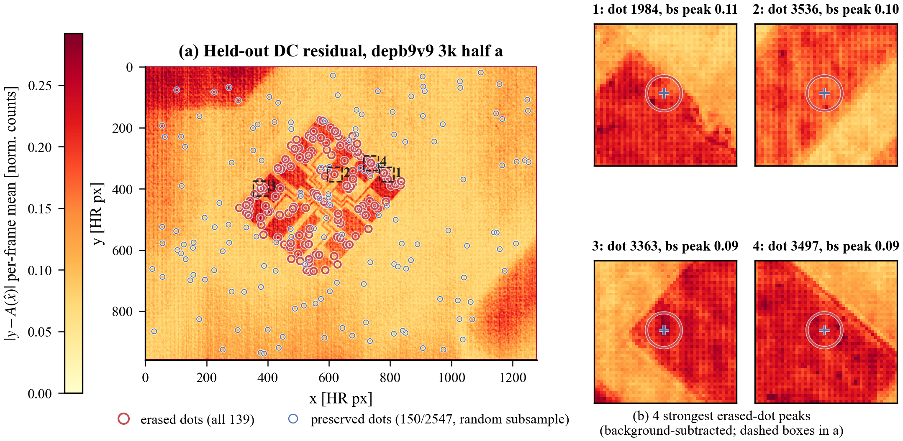

**空间核验：139 个被抹除点的位置与残差峰精确对得上。** depb9v9_3k 半幅留出残差图上全部抹除点红圈标注，坐标经 CSV 数值核验（median |err|=0）；抹除点残差窗口极大值对 3000 个随机位置的 AUC 达 0.887。

*Script: `scripts/fig46_residmap_spatial.py` · Data: `output/dc_residual_confidence/`（`depb9v9_3k_residmap_a.npy`、`per_dot_residual_stats.csv`，ACL-075）*

### Fig 61 — What the DC-Residual Self-Audit Actually Sees

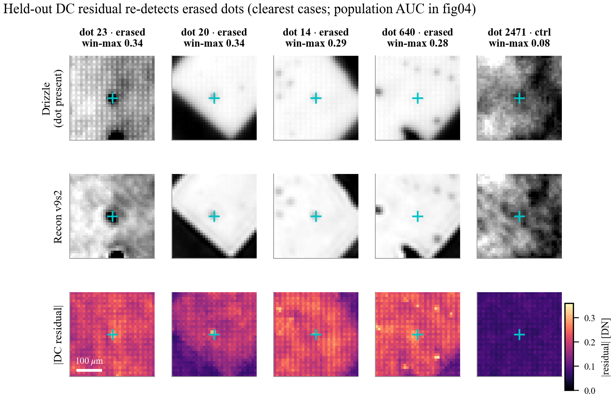

**残差图本身长什么样：被抹的点在十字准星处“重新显形”。** 每列一个探针点，三行为 drizzle 参照 / 被抹重建 / 留出残差 |Ax̂−y|；最右列为保留对照点。展示的是最清晰正例，逐点信号平均较弱（各臂 AUC 0.68–0.84，见 fig04）。

*Script: `scripts/fig61_dc_residual_maps.py` · Data: `output/dc_residual_confidence/`（残差图 + 逐点统计，基于 `remote_inbox/20260710_expab` 重建，σ=0.5 占位 PSF，ACL-074/075）*

---

## 第六章 泛化能力与冠军判决

单一真实会话上的最优不等于可靠。判决体系分三层：**held-out 合成基准 Stage 2b**（fig11/fig45——经典基线首次上合成集，还抓出一个损坏 checkpoint 案例，促成"新 checkpoint 上线前必过健康检查"制度）；**13 个 OOD 池**（9 个 round-1 极端轴 + 4 个生成器语法从不产出的 motif 族，预览 fig43）：depb9v6 对 oracle 锚 13/13 零符号翻转完胜（fig03，逐场景 fig18，语法外 fig95），v9 代两臂大面积倒输且失效模式是全局 DC 负漂 + 低频发散（fig44）；**头条判决 = 点保真↔OOD 单调权衡定律**——点保真冠军 v9-3k 恰是域外最差的臂（fig99）。冠军选择因此被显式表述为多轴帕累托问题（fig91/fig02/fig93），排序经 3 个独立切分验证稳健（fig94）、重建对切分视觉不变（fig96）。

**冠军决策矩阵**（数值口径：cross-FRC@30µm 对 drizzle、校正后、seed-42 切分；OOD 为 13 池对 TGV(oracle) 胜场）：

| 臂 | cross-FRC@30µm | 孤立点抹除率 | OOD 胜场 | range_exc | 判决 |
|---|---|---|---|---|---|
| TGV（经典） | **0.7017** | 无点探针（参照臂） | 参照锚 | 1.6–4.4 健康 | 经典上界，仍未被超越 |
| **depb9v6** | 0.6611 | 4.66% | **13/13**（Δ+0.171） | 2–2.7 健康 | ✅ **均衡冠军** |
| depb9v9_9bin | 0.6252 | 1.55% | 2/13（Δ−0.136） | 12–16 异常 | 两轴皆非最优 |
| depb9v9_3k | 0.6245 | **0.00%**（retention 0.798） | 0/13（Δ−0.275） | 12–16 异常 | 点保真冠军，OOD 最差 |

口径注（ACL-078）：全部 13 个 OOD 池上 tgv_oracle 系统性弱于 tgv_portable（oracle 语义待复核）；对更强的 portable 基线，v6 在语法外内容上收窄为打平——诚实边界见 fig95。

| 图 | 内容 | 关键结论 |
|---|---|---|
| fig11 | Stage 2b 分层基准 | 经典首次上合成集；v20 损坏 checkpoint 案例 |
| fig45 | Stage 2b 全景散点 | 双基准全部臂 FRC × range_exc 一图尽收 |
| fig43 | 语法外 motif 族预览 | 四族 eval-only 场景，生成器从不产出 |
| fig03 | OOD round-1 判决 | v6 9/9 全胜 oracle；3k 0/9 全输 |
| fig18 | OOD 逐场景配对分布 | 胜/败均非离群场景驱动（胜率 69–98% vs 0–44%） |
| fig44 | OOD 次级指标 | v9 代全局 DC 负漂 −2~−5.5°C + range_exc 高一个量级 |
| fig95 | 语法外内容判决 | v6 对 oracle 4/4 胜；对 portable 打平（诚实边界） |
| fig99 | 权衡定律头条 | 点保真↔OOD 单调权衡；v6 是均衡冠军 |
| fig91 | 追赶 TGV 的代价 | 健康臂天花板 ~0.67；更接近 TGV 者必伴病理 |
| fig02 | 冠军帕累托前沿 | 抹除率 × FRC 非支配前沿 + OOD 标签 |
| fig93 | 四轴平行坐标 | 候选臂四条验收轴对比，缺测如实留白 |
| fig94 | 多切分排序验证 | tgv > v6 > v9 代在 seed 42/123/456 全部成立 |
| fig96 | 切分视觉不变性 | 重建由数据驱动，非切分方式驱动 |

### Fig 11 — Stage 2b Synthetic Benchmark Stratified

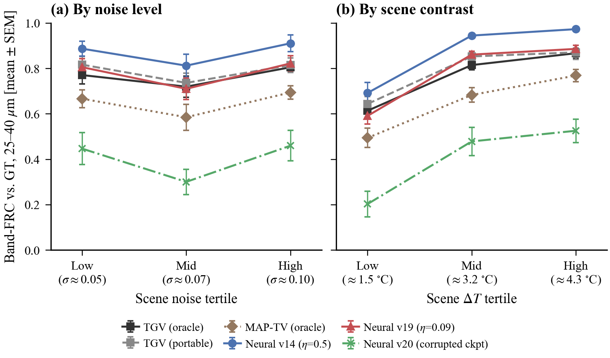

**判决体系第一层：从未训练过的 48 景合成留出基准，经典基线首次同台。** 按噪声档与辐射对比度三分位分层的频带 FRC；v20_champion 在此被查出是损坏 checkpoint——促成“新 checkpoint 上线前必过合成健康检查”制度。

*Script: `scripts/fig11_stage2b_stratified.py` · Data: `remote_inbox/20260711_stage2b/stage2b_stratified_{noise,deltaT}.csv`（ACL-054/060）*

### Fig 45 — Stage 2b Synthetic-Benchmark Panorama

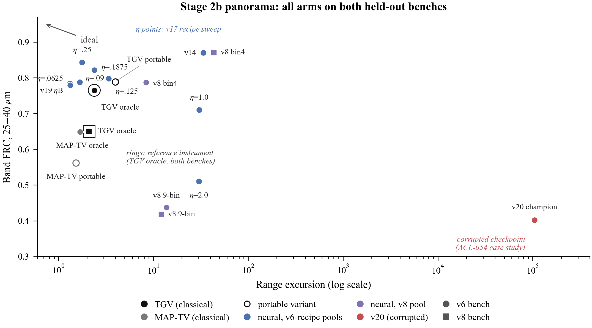

**Stage 2b 全景：所有臂在“频带 FRC × 低频稳定性”平面一图尽收。** 理想角落为左上；v20 损坏 checkpoint（range_exc ~10⁵）与 v8 时代的 range_exc 膨胀清晰可见；tgv_oracle 圆环作跨基准参照。

*Script: `scripts/fig45_stage2b_panorama.py` · Data: `remote_inbox/20260711_stage2b/stage2b_summary.csv` + `20260717_v8_champion/`（ACL-054/071）*

### Fig 43 — Out-of-Grammar Motif-Family Previews

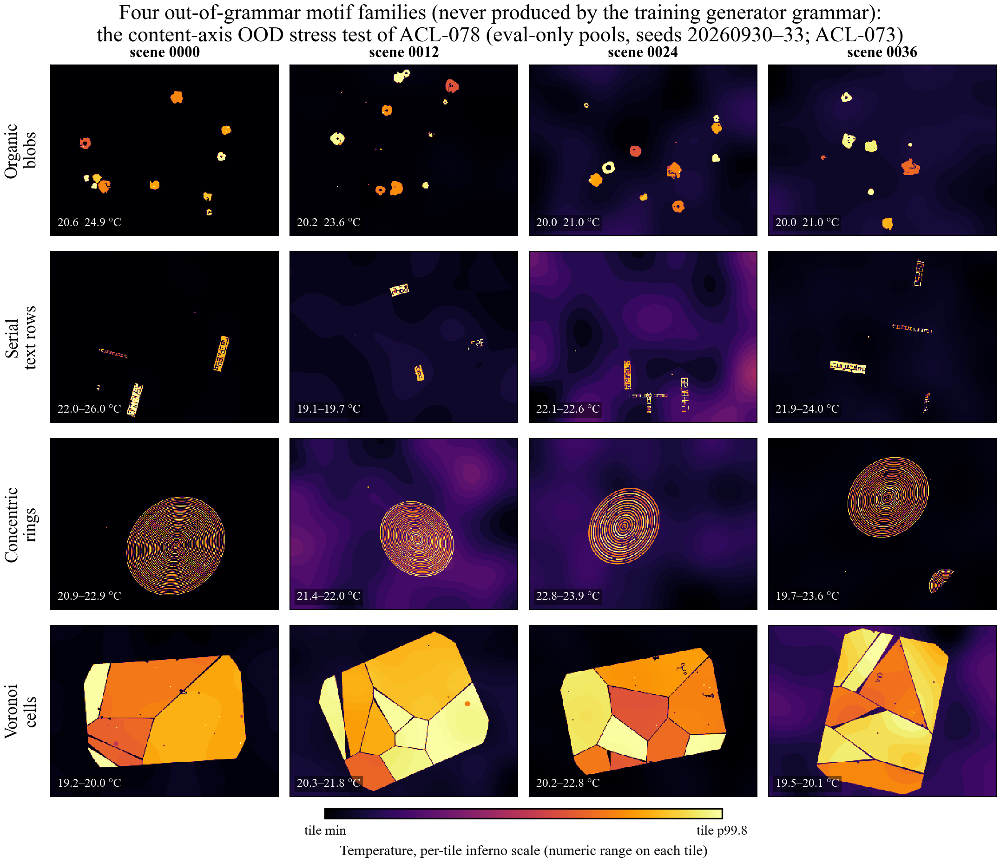

**OOD 压力测试的“考题”预览：生成器语法从不产出的四个 motif 族。** organic blobs / serial text / concentric rings / voronoi cells，每族 4 个 eval-only 场景；逐 tile 标尺并标注实际温度范围，避免共享标尺把低 ΔT 场景压成全黑。

*Script: `scripts/fig43_ood_motif_previews.py` · Data: `remote_inbox/20260713_content2ms/motif_previews/fig43_previews.npz`（240×320 float16 HR 真值预览，自 960×1280 hr_temperature_2x.npy 抽取 /4，2026-07-13 从 5090 取回；ACL-073/078）*

### Fig 03 — OOD Robustness Verdict

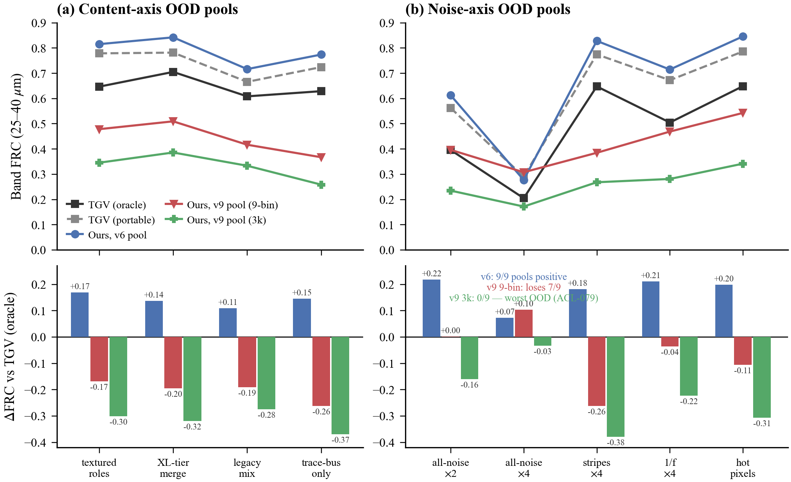

**OOD round-1 判决：depb9v6 在全部 9 个极端池上零符号翻转完胜 oracle。** 上排为绝对频带 FRC，下排为相对 TGV(oracle) 的差值；depb9v9_9bin 输掉 7/9，点保真冠军 3k 则 0/9 全输、最差 −0.38。

*Script: `scripts/fig03_ood_robustness.py` · Data: `remote_inbox/20260712_oodC/ood_degradation_summary.csv`（48 场景/池，ACL-076）*

### Fig 18 — Per-Scene OOD Paired-Difference Distributions

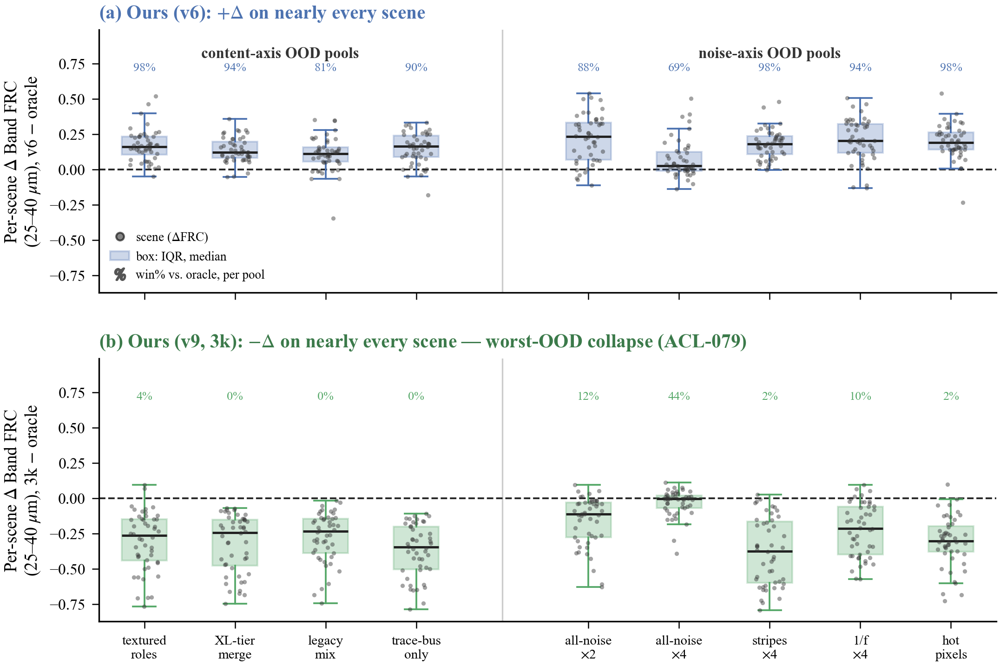

**配对逐场景版：OOD 的胜与败都不是离群场景驱动的。** (a) v6 − oracle 几乎逐场景为正（逐池胜率 69–98%）；(b) 3k − oracle 几乎逐场景为负（胜率 0–44%）——上正下负构成同尺度镜像。

*Script: `scripts/fig18_ood_perscene.py` · Data: `remote_inbox/20260712_oodC/ood_degradation_long.csv`（9 池×5 臂×48 场景=2160 行，ACL-079 五臂重建，md5 c1f6f716；四个既有臂逐位复现 ACL-076）*

### Fig 44 — OOD Secondary Metrics

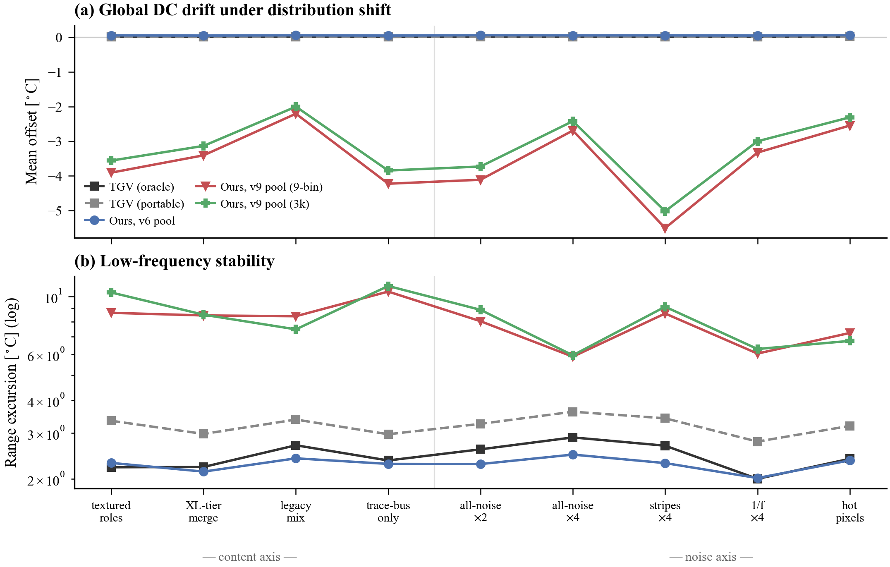

**v9 代 OOD 失效的模式诊断：不是纹理损失，而是全局 DC 拉偏 + 低频发散。** v9_9bin/3k 在每个池上系统性负漂 −2~−5.5°C（v6 与经典臂接近零）；range excursion 比 v6/TGV 高一个数量级——域内未决异常（fig40）延伸到了 OOD 轴。

*Script: `scripts/fig44_ood_secondary_metrics.py` · Data: `remote_inbox/20260712_oodC/ood_degradation_summary.csv`（ACL-076）*

### Fig 95 — Out-of-Grammar Content Axis Verdict

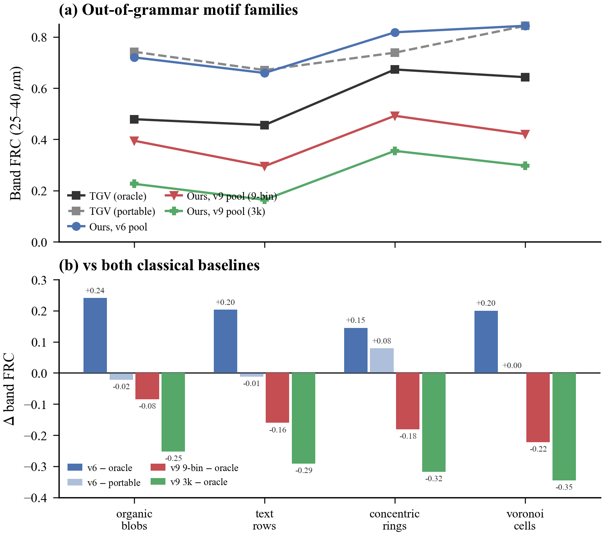

**语法外内容轴判决 + 诚实边界：v6 对 oracle 4/4 全胜，但对更强的 portable 基线只是打平。** 四个语法外 motif 族上 v9 两臂 4/4 落败（3k 更差，−0.25~−0.35）；全部 13 个 OOD 池上 oracle 系统性弱于 portable（语义待复核）——这是同时展示两条基线的原因。

*Script: `scripts/fig95_content2_verdict.py` · Data: `remote_inbox/20260713_content2ms/ood2_degradation_summary.csv`（ACL-078）*

### Fig 99 — Point-Fidelity vs OOD-Robustness Trade-off

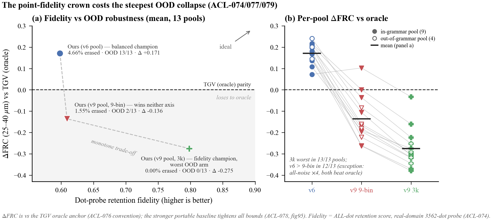

**收官头条（ACL-079）：点保真桂冠以最陡的域外崩溃为代价。** retention × 13 池平均 ΔFRC 上三臂落在单调权衡线：v6 均衡冠军（13/13 胜，Δ+0.171）、9bin 两轴皆非（2/13）、3k 保真冠军但全输（0/13，Δ−0.275）；逐池佐证 + 胜场现场重算 fail-loud。

*Script: `scripts/fig99_fidelity_ood_tradeoff.py` · Data: `data/champion_arms.csv`（ACL-074）+ `remote_inbox/20260712_oodC/ood_degradation_summary.csv` + `remote_inbox/20260713_content2ms/ood2_degradation_summary.csv`（ACL-076/078/079）*

### Fig 91 — Chasing TGV: FRC Record and Its Price

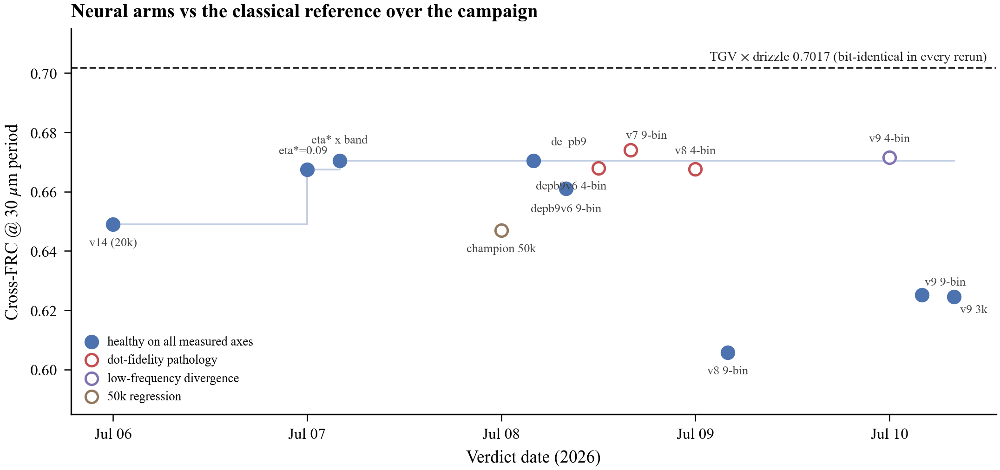

**追赶 TGV 的代价曲线：健康臂天花板 ~0.67，更接近者必伴病理。** 按时间排列各代表性神经臂相对 TGV 参照（0.7017）的 FRC@30µm：实心点=无已知病理（历史最高 0.6705），空心点=增益伴随抹点或低频发散——这正是冠军帕累托问题的成因。

*Script: `scripts/fig91_gap_evolution.py` · Data: `data/gap_evolution.csv`（ACL-050~074）*

### Fig 02 — Champion Selection as a Pareto Problem

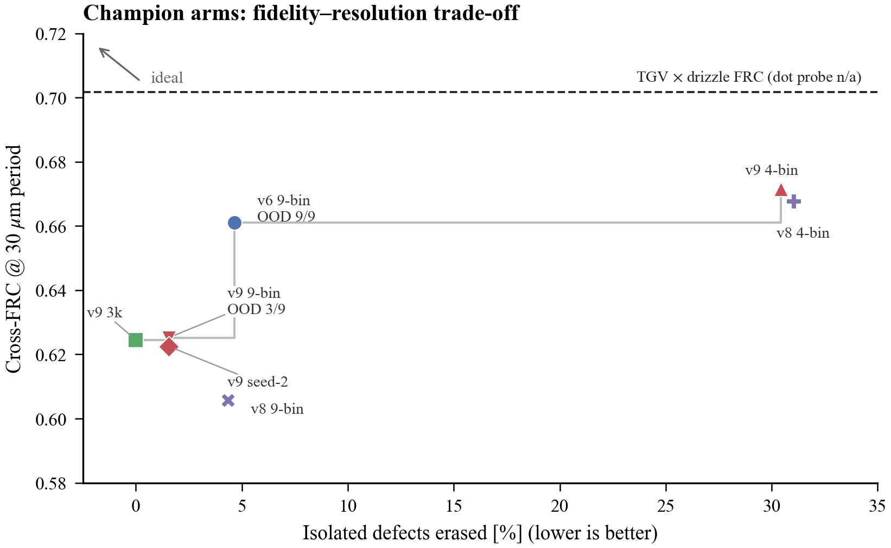

**冠军选择的正式表述：抹除率 × FRC 平面上的帕累托前沿。** 阶梯线标出非支配前沿，无点探针的经典 TGV 只作水平参照，已测得的 OOD 胜场以标签叠加——没有全域赢家，只有权衡。

*Script: `scripts/fig02_champion_pareto.py` · Data: `data/champion_arms.csv`（ACL-064/071/072/074/076）*

### Fig 93 — Champion Candidates on Four Acceptance Axes

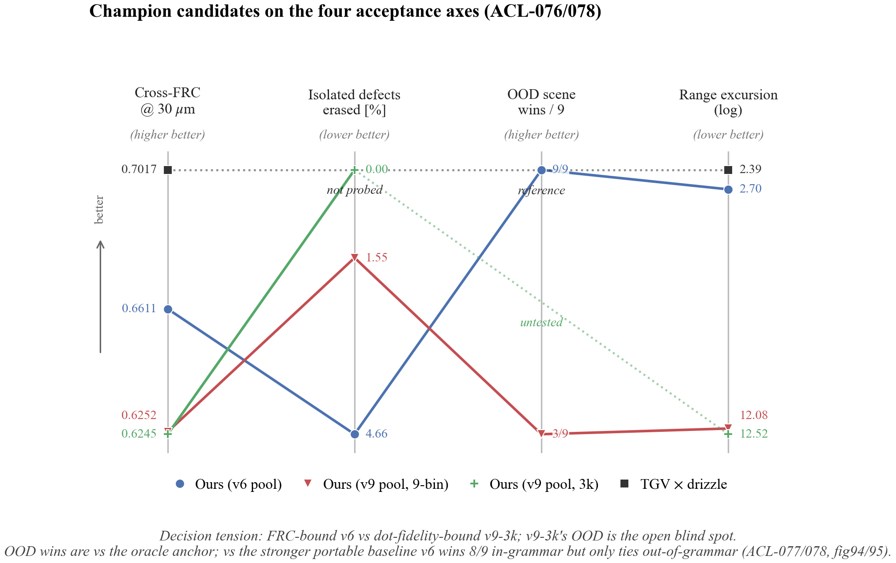

**四条验收轴一图对比：候选臂的长短板与缺测如实展示。** cross-FRC / 孤立点抹除 / OOD 胜场 / range_exc 的平行坐标图（各轴归一化“上=更好”）；缺失值（v9-3k 当时无 OOD 测量、TGV 无点探针）虚线桥接留白，不做臆造填补。

*Script: `scripts/fig93_champion_axes.py` · Data: `data/champion_axes.csv`（ACL-071/072/074/076）*

### Fig 94 — Champion Ranking Is Split-Choice Robust

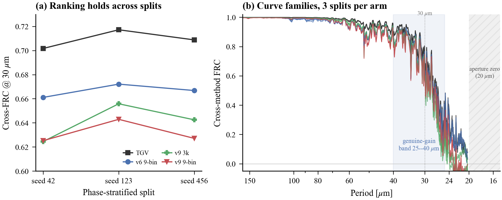

**排序不是切分运气：tgv > v6 > v9 代在三个独立切分下全部成立。** seed 42/123/456 下绝对值波动 ~0.01–0.03 但冠军排序从未翻转；三切分的完整 cross-FRC 曲线族在约 24µm 以上处处紧致——判决是曲线级的，不是单频点的偶然。

*Script: `scripts/fig94_multisplit_ranking.py` · Data: `remote_inbox/20260713_content2ms/ms_verdict.csv` + `ms_curves/lb_seed{42,123,456}/frc_curves_long.csv`（取自 5090 `output/stage2p5_multisplit_v2`，2026-07-13 完成，ACL-077）*

### Fig 96 — Reconstructions Are Visually Invariant to the Split Seed

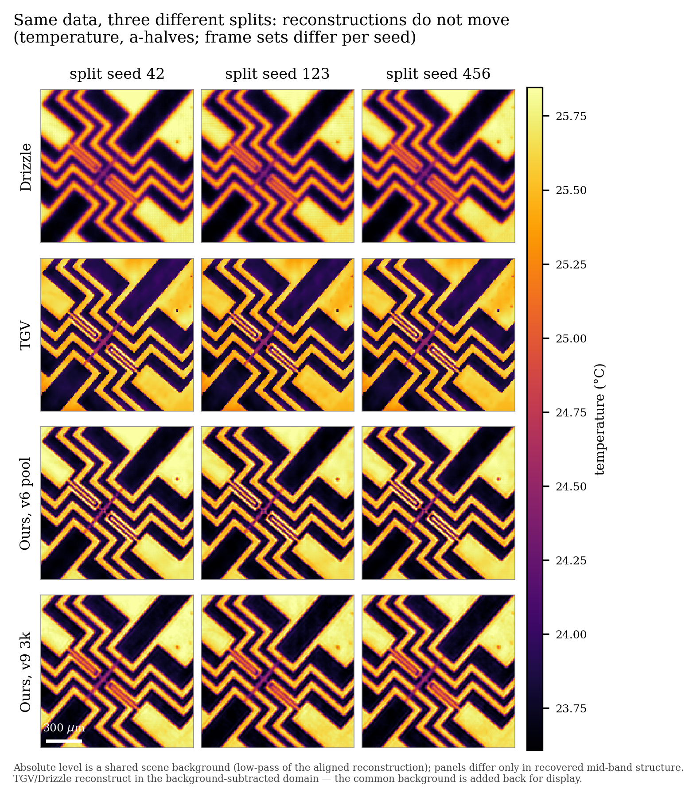

**视觉版切分稳健性：重建由数据驱动，不是切分方式驱动。** 臂 × 切分 seed（42/123/456）的温度图矩阵（远端 5090 渲染）；不同 seed 的半幅帧集合并不相同，行内面板的一致性即是证据。神经臂为绝对温度，经典臂加回共享背景层以同一摄氏标度并置（图注注明）。

*Script: `scripts/fig96_split_visual_consistency_REMOTE.py`（远端渲染归档脚本，不在本地运行） · Data: 5090 上的 `output/stage2p5_multisplit_v2`（+ seed42 臂来自 dot_probe_expab / stage0h_frc_recons / stage0g_frc_refined，ACL-077）*

---

## 第七章 最终视觉成果

指标判决之外，最终交付要回答两个朴素问题：**图更清楚了吗？多出来的细节可信吗？** 统一显示口径的真实数据蒙太奇（fig10）；FRC 增益在频域"住在哪"——25–40 µm 验收带的环带分解（fig66）；各臂相对 drizzle 到底改了哪里——新增对比度锚定在真实走线边缘、而非漂浮纹理（fig68）；光学显微真值配准提供独立于热数据的几何验证（fig60）；"最锐 ≠ 最优"的教科书对比——目视最锐的 v5 臂指标却是神经最低档，其锐度大半是幻觉（fig98）；最后三个训练世代同框收官，展示从原始祖先到冠军的累积项目进步（fig97）。

| 图 | 内容 | 关键结论 |
|---|---|---|
| fig10 | 真实数据蒙太奇 | 3 ROI × 4 臂，统一显示口径 |
| fig66 | 频带分解 | 增益住在 25–40 µm 验收带；20–25 µm 次带从不声称已恢复 |
| fig68 | 相对 drizzle 差值图 | 新增对比度锚定真实结构 |
| fig60 | 光学真值配准 | NCC 0.985；走线等高线与热结构几何一致 |
| fig98 | 最锐 ≠ 最优 | v5 0.626 < 冠军 0.661 < TGV 0.702 |
| fig97 | 三代同框收官 | v4 → v5 → 冠军的累积进步（诚实标注非受控消融） |

### Fig 10 — Real-Data Visual Comparison Montage

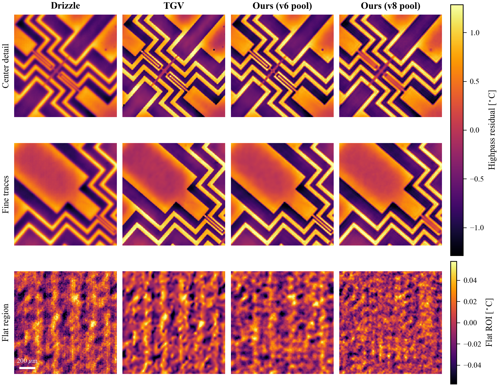

**最终视觉交付的主蒙太奇：3 个感兴趣区 × 4 臂，统一显示口径。** 中心细节/高频走线/平坦区 × drizzle/TGV/ours-v6/ours-v8；统一 σ=10 HR px 高通显示变换 + 共享对称标尺，比例尺 200µm。

*Script: `scripts/fig10_real_visual_montage.py` · Data: `remote_inbox/20260716_v8_verdict/*.npy`（裁剪窗复用 visboard manifest，ACL-070 时代）*

### Fig 66 — Where the FRC Gain Lives: Band Decomposition

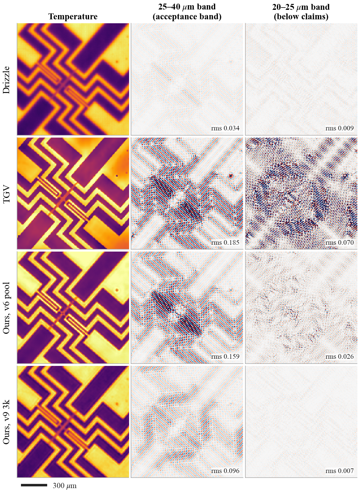

**多出来的细节住在哪个频段：验收带环带分解。** 中心 ROI 的 FFT 环带分解显示 drizzle 在 25–40µm 真实增益带内容明显弱于 TGV/v6；20–25µm 次带高于孔径零点但低于权威截止 25.45µm，其内容从不声称为已恢复（TGV 在此带能量可观但未经验证）。

*Script: `scripts/fig66_band_decomposition.py` · Data: `remote_inbox/20260710_expab`（seed-42 a 半幅；频带计量 ACL-071/072，可恢复带判决 ACL-049/059）*

### Fig 68 — What Each Arm Changes Relative to Drizzle, Spatially

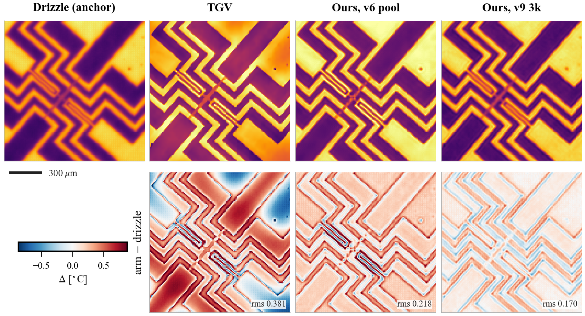

**各臂相对 drizzle 到底改了哪里：新增对比度锚定在真实走线边缘。** 差值图显示三个臂都在锐化相同的走线（红蓝条纹紧贴布局）而非漂浮纹理；TGV 条纹最强但伴阶梯块状化，v9-3k 最保守。

*Script: `scripts/fig68_delta_vs_drizzle.py` · Data: `remote_inbox/20260710_expab`（seed-42 a 半幅，配准校正到 drizzle 网格；cross-FRC 计量臂语境 ACL-071/076）*

### Fig 60 — Optical Ground Truth Registered onto the HR Thermal Grid

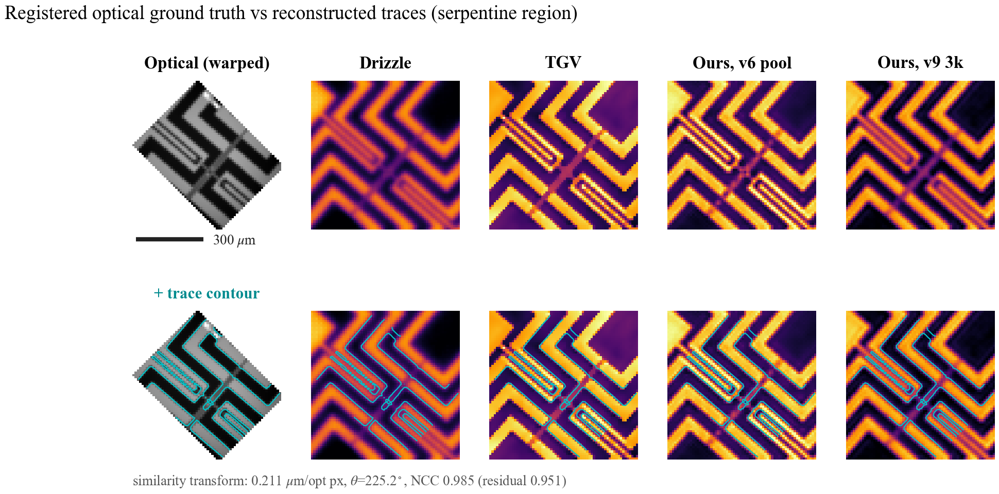

**独立于热数据的几何验证：光学显微真值配准到 HR 热网格。** 相似变换配准（θ=225.2°，NCC 峰值 0.985）；光学走线边界等高线叠加到各臂重建上，重建热走线与真值走线布局的几何一致性直接可见。

*Script: `scripts/fig60_optical_registration.py` · Data: `remote_inbox/20260713_dotprobe/optical_warp_hr.npy` + `remote_inbox/20260710_expab/*_a*.npy`（光学配准时代，ACL-071/076 冠军臂）*

### Fig 98 — v5-hybrid vs Champion vs Classical over the Registered Optical GT

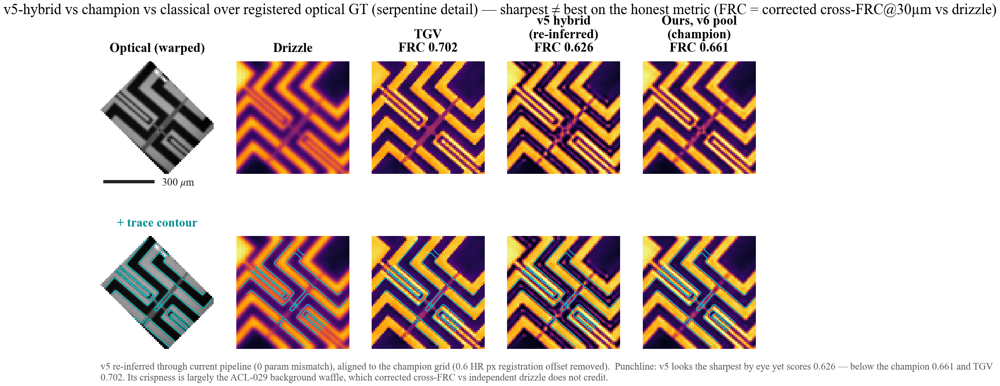

**全项目诚实评测方法论的教科书一图：“最锐 ≠ 最优”。** 目视最干净的 v5 臂拉进光学配准对比：中心线圈确实最锐，但背景带 ACL-029 记录的 ~2px 棋盘纹理，corrected cross-FRC 0.626 < 冠军 0.661 < TGV 0.702——表观锐度大半是幻觉（ACL-080）。

*Script: `scripts/fig98_v5_vs_champion_optical.py` · Data: `remote_inbox/20260710_expab/{drizzle_a,tgv_a,depb9v6_a_corrected,v5sharp_a_corrected_roi}.npy` + `remote_inbox/20260713_dotprobe/optical_warp_hr.npy`（v5 重评时代，ACL-080）*

### Fig 97 — Solver Generational Evolution: Primitive Ancestor → Champion

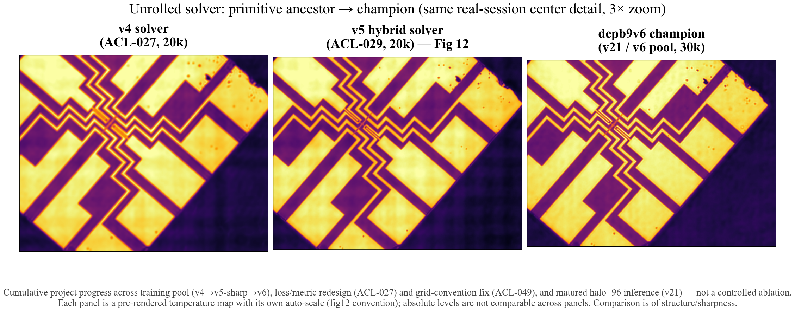

**收官合影：从原始祖先到冠军的累积项目进步。** v4（线圈浑浊、背景波纹）→ v5 hybrid（边缘立起但 ~2px 格纹）→ depb9v6 冠军（最干净、最锐、背景最平）同框；图注诚实标注这不是受控消融——面板间同时变了训练池、loss、网格校正与推理配置。

*Script: `scripts/fig97_solver_generational_evolution.py` · Data: `remote_inbox/20260627_checkpoint_evolution/solver_v4_acl027/` + `.../20260628_hybrid_solver/eval_real_png/` + `remote_inbox/20260705_depb9v6_champion/`（v21 冠军 real-eval PNG）*

---

## 附录 A 早期方法基准补遗

以下两图属于展开 solver 主线之前的旧 episode 方法探索与经典锚点（时间线阶段 I），与主叙事关系较远，归档于此备查：fig51 是 EP15 M4 反卷积锚——经典"待超越"基线在 2.5x 任务上的四臂对比；fig52 是 EP08 对 INR/decoder 类学习先验的五方法系统对比（SIREN 曾为当时的推荐方案）。

### Fig 51 — EP15 M4 Deconvolution Anchor: Four-Arm Comparison + Zigzag Profiles

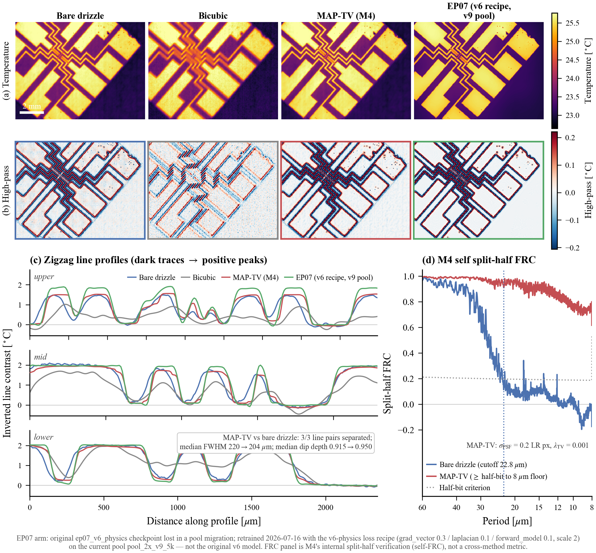

**旧 episode 的经典锚点：EP15 M4 反卷积基线（2.5x 时代的“待超越”对象）。** 四臂对比（bare drizzle/bicubic/MAP-TV/EP07）+ zigzag 暗迹剖线（MAP-TV 中位 FWHM 220→204µm、3/3 线对分离）+ M4 自分半 FRC 验证。EP07 臂为 v6 损失配方在 v9 池重训（原 checkpoint 已在池迁移中丢失），图注如实标注。

*Script: `scripts/fig51_ep15_m4_deconv.py` · Data: `remote_inbox/20260716_ep15_m4/`（M4 产物 fig51_data.npz + zigzag/frc/param CSV；EP07 臂 checkpoint = v6 配方在 v9 池重训 2026-07-16，非原 v6 池）*

### Fig 52 — INR/Decoder Priors vs Classical MAP-TV

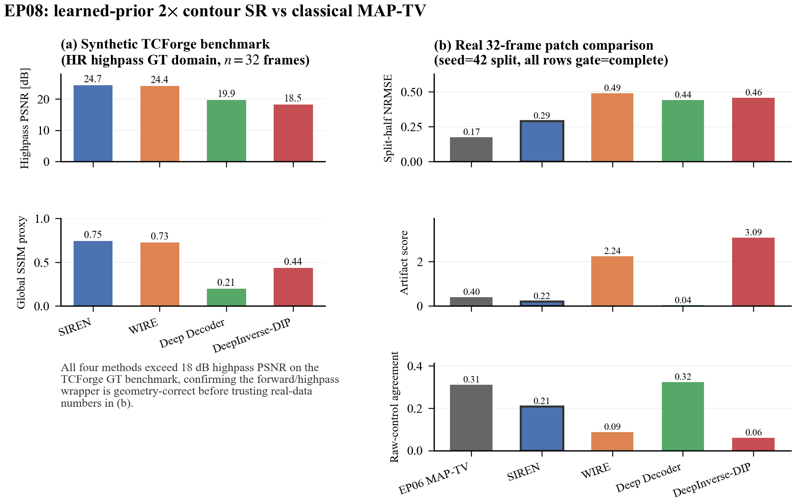

**solver 立项之前的方法探索：EP08 学习先验（INR/decoder）五方法对比。** SIREN 曾以分半稳定性最佳、伪影风险低被推荐为 Stage 3 方案；WIRE/DIP 留出残差更低但伪影风险明显更高。这些早期结论后被展开 solver 主线取代。

*Script: `scripts/fig52_inr_methods.py` · Data: `data/inr_methods.csv`（转录自 `research_log/episodes/ep08_inr_sr/README.md`，EP08）*

---

## 附录 B 图号速查表

按图号排序的全册索引（72 图）：

| 图号 | 标题 | 所在章节 |
|---|---|---|
| fig00 | The Storyline in Four Acts | 序章 项目全景 |
| fig01 | Pool Evolution: Dot-Fidelity Saga Across Generations | 第五章 点保真攻坚与训练池演化 |
| fig02 | Champion Selection as a Pareto Problem | 第六章 泛化能力与冠军判决 |
| fig03 | OOD Robustness Verdict | 第六章 泛化能力与冠军判决 |
| fig04 | DC-Residual Self-Doubt Gauge | 第五章 点保真攻坚与训练池演化 |
| fig05 | Training Dynamics: Unrolled Solver vs UNet | 第三章 重建算法演化：从 UNet 到物理展开 solver |
| fig06 | Real-Data Cross-FRC Leaderboard | 第二章 诚实的测量仪器：评价方法论 |
| fig07 | The +0.5px Grid-Convention Artifact and Correction | 第二章 诚实的测量仪器：评价方法论 |
| fig08 | Dot-Erasure Prior Needs Pool Scale | 第五章 点保真攻坚与训练池演化 |
| fig09 | Dot-Probe Retention Stratified by Size/Depth/Isolation | 第五章 点保真攻坚与训练池演化 |
| fig10 | Real-Data Visual Comparison Montage | 第七章 最终视觉成果 |
| fig11 | Stage 2b Synthetic Benchmark Stratified | 第六章 泛化能力与冠军判决 |
| fig12 | Checkpoint Evolution Strip (Solver vs UNet) | 第三章 重建算法演化：从 UNet 到物理展开 solver |
| fig13 | Sigma Self-Calibration (E3) Bench Re-Verdict | 第一章 数据与物理基础 |
| fig14 | DC-Weight (eta) Calibration | 第三章 重建算法演化：从 UNet 到物理展开 solver |
| fig15 | V8/K4 Full-Halo Solver Training Diagnostics | 第三章 重建算法演化：从 UNet 到物理展开 solver |
| fig16 | Forward-Operator Self-Check | 第一章 数据与物理基础 |
| fig17 | v21 Checkpoint Convergence Sweep | 第三章 重建算法演化：从 UNet 到物理展开 solver |
| fig18 | Per-Scene OOD Paired-Difference Distributions | 第六章 泛化能力与冠军判决 |
| fig19 | Detector Pitch vs Resolution vs SR Grid | 第一章 数据与物理基础 |
| fig20 | v7 TCForge Synthetic Scene Showcase | 第四章 合成训练数据引擎 TCForge |
| fig21 | Per-Frame Shift Error Was the Top Bottleneck | 第二章 诚实的测量仪器：评价方法论 |
| fig22 | K4 Glow-Box Artifact Root Cause | 第三章 重建算法演化：从 UNet 到物理展开 solver |
| fig23 | Outer Halo Sweep Suppresses Glow-Box | 第三章 重建算法演化：从 UNet 到物理展开 solver |
| fig24 | GroupNorm+SE Break Extent-Invariance | 第三章 重建算法演化：从 UNet 到物理展开 solver |
| fig25 | Tile-Seam Spectral Diagnostic | 第三章 重建算法演化：从 UNet 到物理展开 solver |
| fig26 | De-Waffle Warm Start | 第三章 重建算法演化：从 UNet 到物理展开 solver |
| fig27 | D-E Prox High-Frequency-Residual Arms | 第三章 重建算法演化：从 UNet 到物理展开 solver |
| fig28 | v4-Era Checkpoint Strip | 第三章 重建算法演化：从 UNet 到物理展开 solver |
| fig29 | Grid-Offset Probe Stability Across Eras | 第二章 诚实的测量仪器：评价方法论 |
| fig30 | Which 0D Regression Metrics Separate Good From Bad | 第二章 诚实的测量仪器：评价方法论 |
| fig31 | Drizzle Split-Half FRC Is Split-Choice Robust | 第二章 诚实的测量仪器：评价方法论 |
| fig32 | Same-Half Control: Self-FRC Hallucination Inflation | 第二章 诚实的测量仪器：评价方法论 |
| fig33 | Cross-FRC Band Table Across Methods | 第二章 诚实的测量仪器：评价方法论 |
| fig34 | Sub-Pixel Phase Occupancy at 5x | 第二章 诚实的测量仪器：评价方法论 |
| fig35 | L1 Zero-Training Detectability Audit | 第五章 点保真攻坚与训练池演化 |
| fig36 | Dot-Probe Detection Funnel | 第五章 点保真攻坚与训练池演化 |
| fig37 | Continuous Retention vs Dot Size | 第五章 点保真攻坚与训练池演化 |
| fig38 | v22-Era Arm Calibration on the Dot Probe | 第五章 点保真攻坚与训练池演化 |
| fig39 | 300-Scene Micro-Arm Endpoint Visuals | 第五章 点保真攻坚与训练池演化 |
| fig40 | The Unresolved Range-Excursion Anomaly | 第五章 点保真攻坚与训练池演化 |
| fig41 | Composer Quality-Gate Audit | 第四章 合成训练数据引擎 TCForge |
| fig42 | Composer Defect-Family Showcase | 第四章 合成训练数据引擎 TCForge |
| fig43 | Out-of-Grammar Motif-Family Previews | 第六章 泛化能力与冠军判决 |
| fig44 | OOD Secondary Metrics | 第六章 泛化能力与冠军判决 |
| fig45 | Stage 2b Synthetic-Benchmark Panorama | 第六章 泛化能力与冠军判决 |
| fig46 | Where the Self-Doubt Gauge Fires (Spatial Map) | 第五章 点保真攻坚与训练池演化 |
| fig47 | Which Residual Statistic Detects Erased Dots | 第五章 点保真攻坚与训练池演化 |
| fig48 | The Sigma Calibration Line: A Three-Act Narrative | 第一章 数据与物理基础 |
| fig51 | EP15 M4 Deconvolution Anchor: Four-Arm Comparison + Zigzag Profiles | 附录 A 早期方法基准补遗 |
| fig52 | INR/Decoder Priors vs Classical MAP-TV | 附录 A 早期方法基准补遗 |
| fig53 | EP02 Displacement Calibration: θ Forest + Visible-vs-Commanded Displacement | 第一章 数据与物理基础 |
| fig54 | EP01 Acquisition Sessions & Step-Stop Raster Trajectory | 第一章 数据与物理基础 |
| fig60 | Optical Ground Truth Registered onto the HR Thermal Grid | 第七章 最终视觉成果 |
| fig61 | What the DC-Residual Self-Audit Actually Sees | 第五章 点保真攻坚与训练池演化 |
| fig62 | The Dot-Erasure Saga, Seen Directly in the Reconstructions | 第五章 点保真攻坚与训练池演化 |
| fig63 | What Self Split-Half FRC Rewards | 第二章 诚实的测量仪器：评价方法论 |
| fig64 | Training-Step Evolution of the Halo=96 Full-Frame Solve | 第三章 重建算法演化：从 UNet 到物理展开 solver |
| fig65 | v7 Training-Horizon Visual Evolution | 第五章 点保真攻坚与训练池演化 |
| fig66 | Where the FRC Gain Lives: Band Decomposition | 第七章 最终视觉成果 |
| fig67 | Anatomy of a Synthetic Training Scene | 第四章 合成训练数据引擎 TCForge |
| fig68 | What Each Arm Changes Relative to Drizzle, Spatially | 第七章 最终视觉成果 |
| fig90 | Project Chronicle: Six Phases on the ACL Progress Axis | 序章 项目全景 |
| fig91 | Chasing TGV: FRC Record and Its Price | 第六章 泛化能力与冠军判决 |
| fig92 | The Measurement Criteria Pipeline | 第二章 诚实的测量仪器：评价方法论 |
| fig93 | Champion Candidates on Four Acceptance Axes | 第六章 泛化能力与冠军判决 |
| fig94 | Champion Ranking Is Split-Choice Robust | 第六章 泛化能力与冠军判决 |
| fig95 | Out-of-Grammar Content Axis Verdict | 第六章 泛化能力与冠军判决 |
| fig96 | Reconstructions Are Visually Invariant to the Split Seed | 第六章 泛化能力与冠军判决 |
| fig97 | Solver Generational Evolution: Primitive Ancestor → Champion | 第七章 最终视觉成果 |
| fig98 | v5-hybrid vs Champion vs Classical over the Registered Optical GT | 第七章 最终视觉成果 |
| fig99 | Point-Fidelity vs OOD-Robustness Trade-off | 第六章 泛化能力与冠军判决 |
