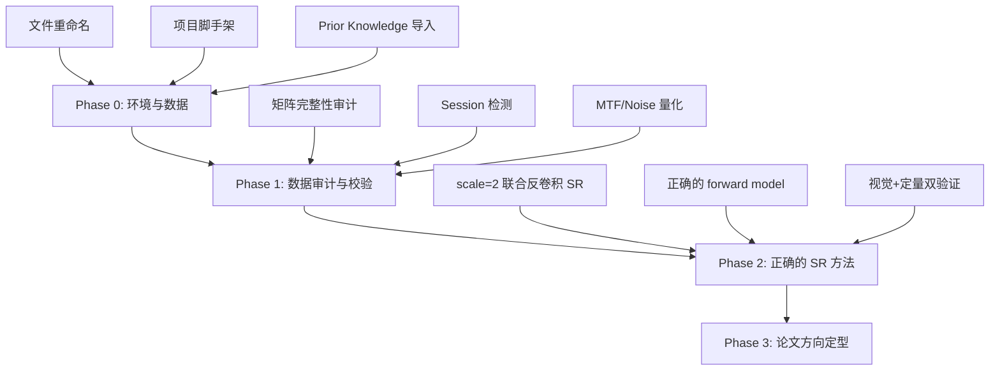

# 从零开始：热场微扫描重建项目 Fresh Start 指南

> [!IMPORTANT]
> 本文档是对当前 `thermal_lift` 项目（19 个 Episode、~4 天密集工作）的全部成果蒸馏。
> 目标：在新主机的空文件夹上重新开始，**不重复已经走过的弯路**，同时**不丢弃已经验证的结论**。

---

## 第一部分：已确认的物理事实（Ground Truth）

这些结论经过多轮实验验证，在新项目中应该直接作为前提，不需要重新证明。

### 1.1 硬件参数

| 参数 | 值 | 来源 |
|---|---|---|
| 探测器输出矩阵尺寸 | 480×640 pixels | Ep001 审计，全部 263 个 TXT 一致 |
| 像素物理尺寸 | **20 μm/pixel** | 用户校准确认 |
| 波段 | 长波红外 (LWIR) 8–14 μm | 用户确认 |
| 探测器标称尺寸 | 512×480 pixel | 用户提供（与 TXT 输出不一致，以实际读取为准） |
| 电动台-像素旋转角 | **θ = 47.6°** | Ep007 SAA 锐度网格搜索，0.1° 精度 argmax |
| 光学 PSF | Gaussian σ ≈ 0.5 pixel = 10 μm | Ep012 blind search 默认值；真实值可能在 0.2–0.5 区间 |
| Noise floor（单次扫描内） | **0.0724°C** | Ep004 smooth 邻坐标 MAE |

### 1.2 数据采集模型

```
BMP/TXT 温度矩阵 = 步进-停拍模式（step-and-shoot）
  → 移动到目标坐标 → 停止 → 采集 → 下一个坐标
  → 无运动模糊，精确对应物理位移
  → 每条扫描线 16 个坐标点

AVI 视频 = 连续扫描模式
  → 静止→连续移动→静止（三段式）
  → 帧率 100 fps（不是 200 Hz）
  → 存在 35-39% 重复帧
  → 移动段 ~170-350 唯一帧
```

> [!WARNING]
> **AVI 视频不适合做超分辨率**。Ep002 已验证 AVI 帧间位移是间歇性大运动（p95=10.4 px），
> 不是稳定亚像素微扫描。不要在这上面浪费时间。

### 1.3 坐标网格与位移

- **坐标集合**: X, Y ∈ {0, 2, 4, 6, 8, 10, 12, 14, 16, 18, 20, 24, 28, 32, 36, 40} μm
- 精细段 0-20 μm：步进 2 μm = **0.1 pixel** 亚像素位移
- 粗糙段 20-40 μm：步进 4 μm = **0.2 pixel** 亚像素位移
- 全程 0-40 μm = **2.0 pixel** 总位移
- 每条扫描线 16 个采样点，13 个 unique 亚像素位置
- **位移范围只覆盖 ~1.35 pixel**（沿扫描轴投影后）

### 1.4 数据完整性

| 项目 | 数量 |
|---|---|
| TXT 温度矩阵 | 263 个，全部 480×640 |
| 配对 BMP 图像 | 263 个，与 TXT 完全配对 |
| 唯一坐标 (X,Y) | 253 个 |
| R=0 网格可用坐标 | 253/256（缺 (14,6), (16,6), (16,16)） |
| 重复测量坐标 | 6 个：(0,0) (2,0) (4,0) (6,0) (8,0) (10,0)，各 R=0,1,2 |
| AVI 视频 | 17 条：8 x-scan + 8 y-scan + 1 参考 |
| 全局温度范围 | 18.21°C – 26.80°C |

### 1.5 Session 结构（关键发现）

> [!CAUTION]
> 数据中存在**跨 session 温度跳变**。这是 Phase 3 最重要的发现。

- 263 个矩阵**不是**在一次连续采集中完成的
- 存在跨 session 的温度状态跳变，中位 **3.55°C（49× noise）**
- 典型例子：`x_Y0` 在 X=8→10 处有 +4.08°C 跳变
- 同 session 内的 step drift 中位仅 **0.017°C（0.24× noise）**，低于 noise floor
- 32 条 R=0 scanline 分类：**22 clean / 6 split / 4 short**
- **跨 session 帧绝对不能混合使用**

---

## 第二部分：硬结论与教训（最重要的部分）

### 2.1 🔴 超分辨率的理论极限

> [!CAUTION]
> **这是项目最大的教训：scale=10 从第一天起就是纯插值，不是超分辨率。**

**MTF 分析（第一性原理）**：

| SR 倍数 | MTF 透过率 | 16 帧有效 SNR | 结论 |
|---|---|---|---|
| 1× | 29% | ~160 | ✅ 单帧已有 |
| 1.3× | 13% | ~22 | ✅ 理论可恢复 |
| 1.5× | 6.3% | ~10 | ⚠️ 勉强 |
| **2×** | **0.7%** | **~1.1** | **❌ 淹没在噪声中** |
| 10× | ~0 | 0 | ❌ 纯插值 |

**实验验证**：
- SAA 在所有 scale 下输出都比 LR 单帧**更模糊**（Tg ratio 0.47-0.62×）
- 单帧 bicubic 2× + Wiener（2.80×）**优于** 16 帧 SAA + Wiener（1.82×）
- MAP+TV 虽然 Tg 数值高（2.76×），但 data loss 发散，用户目视判定不如 LR bicubic

**根本原因**：
1. SAA 缺少 PSF 反卷积步骤（只做对齐+平均，保留全部光学模糊）
2. Nearest-bin 对齐引入额外模糊
3. PSF σ=0.5px 将 2× Nyquist 以上信号衰减到 <1%

### 2.2 多帧数据的真实价值

| 能力 | 实验证据 | 价值 |
|---|---|---|
| **降噪** | 0.135°C → 0.070°C (48%) | ✅ 实实在在 |
| **温度精度** | 16帧平均减少随机误差 | ✅ 工程/计量价值 |
| **Session 检测** | 跨 session 帧污染已解决 | ✅ 数据质量保障 |
| 视觉 SR (2×+) | 全部方法均未成功 | ❌ PSF 硬限制 |

### 2.3 各方法的最终评价

| 方法 | 结论 | 详细教训 |
|---|---|---|
| **SAA (Shift-and-Add)** | ❌ 纯平均=更模糊 | 不做反卷积的多帧融合只能降噪不能增分辨率 |
| **MAP+TV** | ❌ 发散 | 当前实现的梯度下降步长/正则化不稳定 |
| **Blind PSF Search** | ⚠️ 平坦 | σ=0.2 仅弱优于 0.5（2.53%），synthetic 回收偏到 0.9-1.05 |
| **Robust SR (FISTA)** | ❌ 停在 warm start | FISTA 基本没动，因为 SAA 已过度模糊 |
| **INR (SIREN)** | ⚠️ 可用但未超越 SAA | Synthetic smooth 接近 noise floor，但真实数据 residual 更高 |
| **DIP** | ❌ 负结果 | Iteration 25 跳到坏 plateau，early-stop 无法挽救 |
| **DPIR** | ⚠️ 可运行 baseline | Synthetic smooth 效果好（0.8× noise），但真实数据未超越 classical SAA |
| **KernelGAN/ZSSR** | 🔒 兼容性阻塞 | TensorFlow/Python2，不值得投入时间 |

### 2.4 回投残差 ≠ 清晰度

> [!WARNING]
> **不要用回投残差（back-projection residual）来判断 SR 是否成功。**
> 
> 残差衡量的是"HR 退化回 LR 的一致性"，不是"HR 比 LR 更清晰"。
> SAA scale=10 的 HR 残差可以很低（0.04），但图像比 LR 更模糊。
> 这个错误贯穿了 Episode 006-014 的大量实验。

### 2.5 工程教训

1. **不要在 scale=10 上浪费时间**。用第一性原理（MTF/SNR）先算理论极限，再做实验。
2. **先做 scale=2 的视觉对比**，再扩展到更高 scale。
3. **Tenengrad 等锐度指标**不能单独作为 SR 成功证据（Ep007 教训：对齐改善了 Tg 249%，但不是 SR 成功）。
4. **重复测量差异很大**（1-2°C std），不应跨 repeat 混合。
5. **光学 BMP 不适合做 guided SR 强监督**（false-edge rate ~0.89），但可以做 qualitative overlay。
6. **Session boundary 必须先检测**，否则跨 session 帧会严重污染结果。
7. **旋转角标定（47.6°）必须在第一天完成**，否则后续所有方法都用错的位移模型。

---

## 第三部分：值得带走 vs. 应该丢弃

### 3.1 ✅ 带到新项目的东西

#### 文档（直接复制）
- `docs/acquisition_model.md` — 采集模型文档
- `docs/naming_rules.md` — 命名规则（注意：新主机数据还没有重命名）
- `docs/plotting_standards.md` — CVPR 绘图标准
- `configs/stage_calibration.json` — θ=47.6°, pixel=20μm
- `configs/noise_floor.json` — 0.0724°C
- `AGENTS.md` — 工作规范（需根据新环境调整）

#### 结论文档（作为 "Phase 0 Prior Knowledge" 放入新项目）
- 本 fresh start guide
- `research_log/handoff/phase4/research_pivot_synthesis.md` — Phase 4 转折综合报告

#### 代码片段（提取核心逻辑，不要整包复制）
- 旋转 shift 模型公式：`dx = X * cos(θ) / pixel_size`, `dy = X * sin(θ) / pixel_size`
- 文件名解析：`X_Y_R.ext` → parse 三段
- Otsu 零件/背景分割逻辑
- Session boundary detection 逻辑（step > threshold → new session）
- `setup_academic_style()` 绘图函数
- Noise floor 计算方法（smooth adjacent-coordinate MAE）

### 3.2 ❌ 不要带到新项目的东西

- 所有 `outputs/` — 都是旧实现产生的，新实现会重新产生
- 所有 `notebooks/` — 与旧代码强耦合
- `algorithms/deprecated/` — Phase 1-2 废弃代码
- `algorithms/baselines/baseline_2_matrix_sr/` — 基于错误 scale=10 假设
- `algorithms/baselines/baseline_3_2d_grid_sr/` — 同上
- 旧的 episode 日志细节 — 已蒸馏到本文档
- AVI 处理代码 — AVI 不适合 SR

### 3.3 ⚠️ 有条件带走

- `algorithms/baselines/baseline_0_data_audit/` — 审计逻辑有用，但需要适配新的文件名（新主机还没重命名）
- `algorithms/ours/physical_sr/` 中的 `eval.py`, `noise_floor.py`, `roi_classifier.py` — 评估框架有用，但需要重构
- 合成数据生成逻辑 — FEniCS 或简单解析 GT 场 + 合成微扫描矩阵的流程有用

---

## 第四部分：Fresh Start 计划

### 4.0 数据命名（新主机第一步）

> [!IMPORTANT]
> 新主机数据还没有重命名。这是第一件要做的事。

原始文件名可能是旧式连写数字或中文逗号格式，需要统一为 `X_Y_R.ext`：
- `X`: X 坐标 (μm)
- `Y`: Y 坐标 (μm)  
- `R`: 重复编号 (0/1/2)
- 坐标集合: {0, 2, 4, 6, 8, 10, 12, 14, 16, 18, 20, 24, 28, 32, 36, 40}

需要一个命名转换脚本。旧项目中做过这个步骤但脚本不在 git ���。

### 4.1 推荐的阶段计划



#### Phase 0：环境与数据（Day 1）

1. **建项目脚手架**
   ```
   project/
   ├── AGENTS.md
   ├── data/raw/           ← 只读原始数据
   ├── data/sample/        ← 调试样本
   ├── algorithms/
   ├── configs/            ← 直接复制旧项目的 3 个 JSON
   ├── docs/               ← 复制 acquisition_model, naming_rules, plotting_standards
   ├── outputs/
   ├── reports/
   ├── research_log/
   │   ├── current.md
   │   ├── findings.md
   │   ├── decisions.md
   │   ├── prior_knowledge.md  ← 本文档的精华版
   │   └── episodes/
   └── paper/
   ```

2. **文件重命名**：写脚本��旧格式文件名转为 `X_Y_R.ext`
3. **导入 Prior Knowledge**：把本文档的 §1-§2 作为 `prior_knowledge.md` 放入 `research_log/`
4. **环境设置**：uv + pyproject.toml

#### Phase 1：快速数据校验（Day 1-2）

> [!TIP]
> 不需要从头审计。只需要**校验**旧结论在新数据上是否成立。

- [ ] 确认 263 个 TXT/BMP 全部配对
- [ ] 确认矩阵尺寸全部 480×640
- [ ] 确认温度范围与旧项目一致
- [ ] 确认坐标集合完整性（253 unique + 6 个 3-repeat）
- [ ] 运行 Session boundary detection，确认 clean/split/short 分类
- [ ] 计算 noise floor（smooth adjacent-coordinate MAE），确认 ~0.072°C

#### Phase 2：用正确的方法尝试 SR（Day 2-5）

**核心改变：scale=2，带反卷积，正确的 forward model**

```python
# 正确的前向模型
# y_k = D · H · S_k · x + n_k
#
# S_k: 已知亚像素位移（旋转模型，θ=47.6°）
# H:   PSF 卷积（Gaussian σ=0.5px，或 blind estimate）
# D:   降采样 2×
# x:   HR 温度场
# y_k: 第 k 帧 LR 观测

# 必须用稳定的逆问题求解器：
# - FISTA 或 ADMM（不是简单梯度下降）
# - Bilinear/bicubic 插值的 forward model（不是 nearest-bin）
# - TV 或小波正则化
# - 已知 session 内帧的子集
```

**视觉验证流程**：
1. 先拿一条 clean scanline（如 `x_Y4`）
2. 分别生成：LR 单帧 / LR bicubic 2× / 16 帧 SR 2×
3. **并排目视对比** + Tenengrad 定量对比
4. 如果 SR 2× 不优于 LR bicubic 2×，说明当前实现仍有问题
5. 合成数据验证：用已知 GT 确认方法能正确恢复

#### Phase 3：论文方向定型（Day 5+）

根据 Phase 2 结果，选择一个方向：

**方向 A（如果 2× SR 成功）**：
- 主线：physics-consistent thermal micro-scanning SR
- 技术点：旋转台标定 + session-aware + joint deconvolution
- 目标：CVPR / ECCV / IEEE TIP

**方向 B（如果 SR 增益太小）**：
- 主线：robust multi-frame thermal field reconstruction
- 技术点：降噪 48% + session detection + drift compensation
- 目标：IEEE Sensors / Applied Optics / NDT&E International

**方向 C（数据集贡献）**：
- 主线：benchmark dataset for thermal micro-scanning
- 263 配对 thermal+optical、multi-repeat、session-annotated
- 搭配一个简单但正确的 baseline

---

## 附录 A：旋转 Shift 模型

电动台的两个轴与探测器像素网格有 47.6° 旋转：

```python
import numpy as np

THETA_DEG = 47.6
PIXEL_SIZE_UM = 20.0

def coordinate_to_shift(x_um, y_um):
    """将物理坐标 (μm) 转为像素位移 (dx, dy)。"""
    theta = np.radians(THETA_DEG)
    # 台坐标 → 像素坐标
    dx = (x_um * np.cos(theta) + y_um * np.sin(theta)) / PIXEL_SIZE_UM
    dy = (-x_um * np.sin(theta) + y_um * np.cos(theta)) / PIXEL_SIZE_UM
    return dx, dy
```

> [!NOTE]
> 旧项目前 6 个 Episode 都假设台轴与像素轴对齐（θ=0°），导致位移模型错误。
> Ep007 才发现 θ=47.6°，然后不得不重跑所有方法。**新项目必须第一天就用旋转模型。**

## 附录 B：Session 检测算法

```python
def detect_sessions(temperatures, threshold_c=2.0):
    """检测 scanline 中的 session 跳变。
    
    temperatures: list of (coordinate, part_mean_temp)，按扫描顺序
    threshold_c: 跳变检测阈值（默认 2°C ≈ 27× noise）
    
    Returns: list of session segments
    """
    sessions = [[0]]
    for i in range(1, len(temperatures)):
        delta = abs(temperatures[i][1] - temperatures[i-1][1])
        if delta > threshold_c:
            sessions.append([i])
        else:
            sessions[-1].append(i)
    return sessions
```

## 附录 C：新主机文件名转换参考

旧项目中碰到的文件名格式问题：

| 旧格式 | 问题 | 正确格式 |
|---|---|---|
| `210.txt` | 歧义：X=2,Y=10 还是 X=21,Y=0？ | `2_10_0.txt` |
| `240.txt` | 歧义：X=2,Y=40 还是 X=24,Y=0？ | 需要查原始规则 |
| `2，10，0.txt` | 中文逗号 | `2_10_0.txt` |
| `0_0.txt` | 缺少 R 编号 | `0_0_0.txt` |

需要的转换脚本应该：
1. 读取原始 `name_rules.txt` 理解命名规则
2. 建立旧名 → 新名映射
3. 验证映射无歧义
4. 批量重命名（建议先 dry-run 打印映射）

---

## 附录 D：待回答的核心研究问题

来自 Phase 4 handoff，这些问题在新项目中应该优先调研：

1. **在 PSF σ=0.5px 限制下，用什么方法从 16 帧微扫描中提取真正的 2× SR？**
   - 正确的逆问题求解器（FISTA/ADMM + bilinear forward + TV）
   - 位移是已知的（不是 blind registration），这简化了问题
   
2. **1.5× SR 在热成像中是否有实际价值？**
   - 20 μm → ~13 μm 分辨率提升
   - LWIR micro-scanning for IC inspection 文献中的成功案例？

3. **如果 SR 不可行，最佳替代研究方向是什么？**
   - 多帧降噪 + session-aware 温度场重建
   - Benchmark dataset release
   - Robust reconstruction framework
